# LeVCS instance throughput rewrite plan

**Status:** Approved for implementation; Phase 0 contracts frozen  
**Date:** 2026-07-20  
**Owner:** Main implementation lead  
**Target:** 30,000 commits/s minimum and 60,000 commits/s release target, durably acknowledged end to end

No production code should change for this plan until this document is approved. The rewrite is deliberately scheduled before the broader instance workflow surface so that review, CI, mirroring, hooks, and future workflow objects are built on the measured transaction and event model rather than around the current loose-file behavior.

### Normative language

Architecture, protocol, acceptance, risk, and definition-of-done sections specify contracts: **MUST**, **MUST NOT**, **SHOULD**, and **MAY** carry their RFC 2119 meanings; uncapitalized “must” and “may not” are equally normative in prose, tables, and invariants. Section 12 is intentionally imperative because it is the execution procedure for the lead and subagents. Explanatory and historical passages describe rationale rather than adding hidden requirements.

## 1. Executive decision

Build a new node-wide, namespace-isolated storage and ingestion subsystem for `levcs-instance`.

The core design is:

1. A unified append-only transaction journal carries new object bytes, repository creation, every ref compare-and-swap, explicit authority movement, typed accepted-source evidence, transaction identity, and the durable receipt.
2. Complete transaction frames are batched across repositories and covered by one durability fence. A journal becomes an immutable segment when sealed; there is no second hot-path WAL write.
3. Repository state is sharded by `repo_id`. Each shard has one short mutation/sequencing lane; parsing, hashing, graph validation, signatures, policy checks, and most ancestry work run concurrently outside it.
4. A success response is sent only after the transaction frame is durable and the committed snapshot is published.
5. Push and init move to a signed binary v2 envelope. The envelope precedes an otherwise unchanged Pack v1 stream and binds repository identity, a stable operation ID, freshness, authority CAS, typed ref CAS operations, and the exact pack length/hash.
6. Every newly reachable object is parsed and validated through one staged overlay. Authority chains are pinned to the repository's stored genesis/current authority. Pack type mismatches, missing closure, unreachable extras, stale authority, and policy read/parse failures reject the whole transaction.
7. Push, init, mirror apply, instance migration, and future instance-side imports use the same transaction service. Byte-exact offline restore is the sole mutation-path exception: it installs an already verified exported generation without creating transactions or events. No other instance component may write objects or refs.

### Scope boundary

This rewrite replaces instance storage. Local working repositories continue using the current `levcs-core::ObjectStore`, `Refs`, and `.levcs/` loose layout. They have different latency, migration, worktree-index, and GC requirements and do not benefit from cross-repository group commit. The CLI and client will change where required for v2 federation, correct CAS construction, and receive-side verification, but local on-disk migration is not part of this program.

Existing instance roots receive one offline, validated loose-to-segment migrator. The runtime will not dual-read or dual-write old and new formats.

### Explicit non-goals

- PRs, review threads, issues, search, CI orchestration, and the web UI.
- Changing Blob, Tree, Commit, Release, Authority, merge-record, signature, or BLAKE3 object bytes.
- Replacing Pack v1 for object exchange in this rewrite.
- Synchronous federation quorum durability. Source acknowledgment remains local-node durable; replication remains asynchronous.
- Optimizing one contended branch beyond its required linear CAS semantics.
- Cross-repository physical deduplication in v2. Namespace isolation takes priority.
- A compatibility v1 POST ingestion handler.

## 2. Why the current path must be replaced

The measured current path is dominated by one file sync per loose object:

- One 1 KiB object write on persistent Btrfs/NVMe: approximately 4.88 ms.
- One small three-object commit in one repository: approximately 66.7 commits/s.
- The same workload across 16 repositories: approximately 396 commits/s.
- A single append log with one sync per batch measured approximately 6,395 records/s at batch 32, 24,163/s at batch 128, and 79,005/s at batch 512.
- Ed25519 verification measured approximately 39,789 verifications/s/core.

The implementation explains those results:

- `crates/levcs-core/src/store.rs::ObjectStore::write_at` hashes, creates, writes, calls `sync_all`, and renames every new object. It does not fsync the containing directory after rename.
- `crates/levcs-core/src/refs.rs::atomic_write` writes and renames one ref at a time with neither file nor directory sync.
- `crates/levcs-instance/src/lib.rs::handle_push` holds a blocking per-repository mutex while writing every object, validating, walking history, and updating refs sequentially.
- Object writes occur before semantic validation, so a rejected push leaves durable junk.
- Only declared ref tips receive full identity verification. Intermediate commits, ordinary tree/blob closure, unreachable entries, and declared-versus-embedded object types are not comprehensively validated.
- Manifest authority is client-selected and is not pinned to the repository's initialized genesis/current authority. A stale or foreign valid authority chain can be considered.
- Multiple refs and `refs/authority/current` are separately visible and separately fallible.
- `handle_init` creates a skeleton, genesis object, and two refs as separate operations without a catalog transaction.
- `sync_mirror` bypasses the push lock and independently writes objects and refs.
- The process-wide nonce mutex has a 600-second live set and periodically scans the entire map.
- Axum and the blocking client materialize whole packs and duplicate request bodies.

The rewrite is therefore a correctness rewrite with a throughput consequence. Removing `fsync` or weakening verification is not an acceptable path to the target.

## 3. Performance claim and canonical workload

All headline rates mean **new, valid, durably acknowledged commits per second**. They never mean objects/s, requests/s, offered load, duplicates, rejected traffic, or a storage primitive rate.

### Canonical small commit

Each counted commit must:

- Be signed by a real authority member with the required role.
- Add a unique deterministic 1,024-byte pseudo-random Blob.
- Add a canonical one-file Tree referencing that Blob.
- Add a signed Commit referencing the Tree, current authority, and previous tip of its assigned ref.
- Be reachable from a successfully committed typed branch update.
- Pass request/envelope signature, replay, hash, framing, full graph, authority, role, instance policy, repository policy, CAS, and fast-forward checks.
- Reach a response only after the storage transaction's durable sequence is fenced.

Record actual raw, Pack-compressed, application, and wire bytes in every result.

### Headline topologies

- `many-ref`: one repository, 1,024 active agent refs, 64 persistent clients; uniform and Zipf(0.9) ref selection.
- `many-repo`: 256 repositories × 16 refs, 64 persistent clients; uniform and Zipf(0.9) repository selection.

Packs may contain 1, 8, 32, or at most 64 commits. The 60k claim may use any batch up to 64, but batch size and request rate must be published. P4 minimum must independently pass ≥30k commits/s with batch=1 in both headline topologies. P4 release must pass ≥60k commits/s at a published batch≤64 and must also repeat the ≥30k batch=1 gate. Batch-1 and batched latency/request-rate results are separate verdict inputs and may not substitute for one another.

The two batch dimensions are independent. The protocol cap is at most 64 commits in one client push. The storage writer may group up to 512 already validated transactions from many clients into one durability fence. A batch-1 swarm therefore still benefits from cross-request group commit; the 512-transaction append-log result does not authorize a 512-commit client pack.

A single hot ref is also measured but is not a headline topology. It is necessarily ordered and CAS-conflict-prone.

### Release gates

| Gate | Environment | Required result |
|---|---|---|
| P0 correctness | PR suite, properties, fault fixtures | Zero invariant failures; rejected operations expose nothing |
| P1 micro | Codec, hash, signature, journal framing | No unexplained >10% same-host regression; diagnostic only |
| P2 storage transaction | Production `levcs-store` API; 5 min warmup + 15 min measured ×3 | ≥75k canonical commits/s; transaction payload≤64 commits, writer fence group≤512 transactions; p99≤50 ms; durable recovery oracle passes |
| P3 in-process protocol | Real router and all checks; 5 min warmup + 15 min measured ×3 | ≥66k commits/s batched and ≥33k batch=1 in both headline topologies; p50≤20 ms, p95≤50 ms, p99≤100 ms |
| P4 minimum deployed node | Release binary, systemd, Caddy/TLS; 10 min warmup + 30 min measured ×3 | ≥30k commits/s at batch=1 in both headline topologies with the same latency rules |
| P4 release deployed node | Canonical release hardware, systemd, Caddy/TLS; same duration ×3 | ≥60k commits/s at published batch≤64 plus ≥30k batch=1 in both topologies; every run passes; Caddy degradation ≤10% from direct |
| P5 minimum soak | Minimum node, each topology, batch=1 at ≥30k for two hours | Throughput/latency windows and all numeric resource ceilings pass |
| P5 release soak | Release node, each topology, ≥60k for two hours | Crosses at least two checkpoint, compaction, and receipt-expiry cycles; all release and resource gates pass |
| P5 resilience | Deterministic failpoints, random kills, power loss, overload, combined background work | Zero acknowledged loss/torn state; recovery, overload, compaction, federation gates pass |

The release hardware profiles and their complete CPU, RAM, NVMe, filesystem, cache/barrier, NIC, proxy, and kernel configuration must be frozen before P4. A storage primitive result can never be promoted to an instance throughput claim.

At P4/P5, ≥95% of one-minute windows must meet the target and no window may fall below 90%. Aggregate CPU must remain ≤85% and sustained storage utilization ≤90%. `memory.current` must remain ≤80% of the deployed cgroup limit with no swap or OOM event; open FDs must remain ≤80% of `LimitNOFILE`; every queue byte/count cap must hold; compaction debt must return below its low watermark each cycle. Equal-load beginning/end windows may show no positive growth in replay entries, expired receipts, leases, FDs, or non-live index state. Archive every configured ceiling, peak, and time series.

## 4. Non-negotiable invariants

### Identity and object invariants

1. Raw serialized objects and their BLAKE3 IDs remain byte-for-byte unchanged across local repositories, clients, instance segments, mirrors, migration, compaction, backup, and restore.
2. Repository initialization permanently binds `repo_id` and the genesis authority hash in the instance catalog.
3. Every native authority chain terminates at the repository's exact genesis and follows its current authority or one explicit valid successor CAS. The sole exception is a typed `ForeignForkBoundary`: the destination fork Commit is native and cites the destination genesis, while its one source-parent subgraph is independently authenticated to the explicitly bound source repo/genesis and never participates in destination authority CAS.
4. Every newly introduced reachable Commit, Release, and Authority has all required signatures and roles checked. Release verification must require the declared release signer semantics used by `sign_release`.
5. Validation input and Full projection require every Tree/object edge with the expected embedded type. Reduced projections may omit only the explicitly enumerated, already-validated boundary edges carried in signed projection evidence; omitted IDs are never namespace members or advertised as readable. Pack entry type must always equal parsed object type.
6. Instance and repository merge policy are evaluated fail-closed for every newly exposed commit.
7. Unreachable extra pack objects are rejected. Normal push never grants membership to pre-uploaded bytes. Large initial mirror, full-fork, and network-migration projections use only the bounded, invisible projection-staging protocol in §8; it is not an ingestion loophole and cannot expose objects before one final atomic publication.

### Transaction invariants

1. Repository creation, new object visibility, all ref CAS operations, current-authority movement, authenticated typed source evidence, and receipt are one logical transaction.
2. Multi-ref updates are entirely old or entirely new, including after crashes.
3. A success response means every reachable object and ref in the receipt survives immediate power loss under the documented storage stack.
4. An unacknowledged transaction may recover wholly present or wholly absent; it may never be torn.
5. Same-ref CAS has exactly one winner. Disjoint refs may validate concurrently and group into the same durability fence.
6. A failed request exposes no staged object, ref, transaction event, or dedupe hit as committed state.
7. Operation idempotency and server-enforced ID uniqueness are window-scoped, but an accepted operation may not age out while its outcome is unresolved. While an in-flight, resolving, or retained terminal record exists through the signed `retry_until` deadline, same ID/same stable digest attaches or returns the original receipt and same ID/different digest rejects. A request still before append when that deadline passes is definitively rejected as `ReceiptExpired`, appends nothing, and removes its transient reservation; this rejection need not create durable status state because the signed envelope itself is permanently expired. Once append begins, the ID/digest remains reserved and status remains `Resolving` until recovery determines committed versus absent, even beyond the signed deadline. For a committed outcome compute, with checked arithmetic, `receipt_visible_until = max(retry_until, first_receipt_visibility_time + terminal_status_grace)`. The first visibility time lives in committed/checkpoint state; if a crash occurs before it is durably checkpointed, recovery resets it to the later recovery-publication time and therefore only extends retention. Compaction may transition the receipt to `Expired` only after a checkpoint/baseline durably records that deadline; with another checked addition, the tombstone then remains through `receipt_visible_until + status_tombstone_grace`. If recovery proves that no complete frame exists, it releases the reservation and returns definitive `Unknown`/absent-retriable while the signed deadline is live; after the signed deadline the envelope itself returns 410. Because a power loss may leave no durable bytes naming that absent attempt, server-enforced mismatch detection ends with that proved-absent reservation; clients nevertheless MUST retry an ambiguous attempt only with the same ID/digest. Other definitive pre-append validation/policy/conflict failures likewise create no durable ID reservation. Durable committed receipt/digest/retention state survives checkpoint, compaction, backup, and restore. A retry envelope presented after its own signed deadline returns non-retriable `ReceiptExpired`/HTTP 410, but that does not hide a still-resolving or retained committed outcome from authenticated status lookup. Only after the committed tombstone ends does status-by-ID return 404 and permit reuse of that committed ID. Beyond that point the server does not preserve lifetime uniqueness: a fresh, newly signed operation may reuse the ID and is explicitly a new operation. Clients MUST generate random IDs and MUST NOT otherwise reuse them. The invariant does not claim that `operation_id` alone distinguishes historical operations after expiry.
8. Physical `shard_sequence`, segment offsets, checkpoint generations, and shard topology are internal. Logical receipts/events and federation cursors expose per-repository `repo_sequence`; the two sequence domains are never interchangeable.

### Resource invariants

- Request wire/decoded bytes, missing-object IDs, receive-spool memory/disk bytes and FDs, object/ref/graph/authority counts, validation jobs, queued transaction bytes, in-flight/status entries, replay entries/horizon, receipt/terminal/tombstone retention, open segments, snapshot base/request pins, projection-staging sessions/artifacts, and backup leases are bounded and observable.
- Blocking temporary/storage filesystem work and CPU validation never run on Tokio I/O workers; only the receive-spool pool performs receive-spool I/O. Maintenance workers may write and sync only uniquely named, unreferenced checkpoint/compaction/projection-staging artifacts. The shard owner alone assigns manifest-visible names, adopts those artifacts, updates `CURRENT`, publishes committed roots, and unlinks referenced or superseded shard files.
- Overload rejects early with documented retry guidance. It does not turn memory into a queue.
- Namespace membership, not global object existence, controls reads. Identical bytes in private repository A do not make an object readable through repository B.

## 5. Target architecture

```mermaid
flowchart LR
    A[HTTP v2 stream] --> B[Admission and signed envelope]
    B --> C[Bounded Pack v1 stream]
    C --> D[Parse-once staged object index]
    D --> E[Parallel graph identity and policy validation]
    E --> F[Validated transaction plan]
    F --> G[Shard sequencer and final CAS]
    G --> H[Group append]
    H --> I[One durability fence]
    I --> J[Publish snapshot and event]
    J --> K[Durable receipt]
```



### 5.1 New `levcs-store` crate

Add a workspace crate at `crates/levcs-store`. It depends on `levcs-core` for object IDs/framing, but contains no HTTP, identity-role, merge-policy, or federation decisions. It also depends on `levcs-protocol`, because §5.2 requires the shard sequencer itself to assign `repo_sequence` and `previous_event_digest`, compute the event/state digests, and place a signed `CommittedTransactionV1` in the frame; it cannot treat those contracts as opaque bytes. It takes no direct dependency on and makes no call into `levcs-identity` — signing is injected through a `CommitEvidenceSigner` and a test enforces the absence of any `levcs_identity::` path in the crate. The rule is about decisions and calls, not about the transitive link edge that `levcs-protocol` brings in.

Proposed modules:

- `format.rs`: format marker, frame/segment/checkpoint codecs, versioning, checksums, golden vectors.
- `engine.rs`: `StoreEngine`, shard routing, startup/recovery, lifecycle.
- `transaction.rs`: namespace creation, object records, typed ref CAS, authority transition, operation evidence, receipts, error taxonomy.
- `journal.rs`: active append journal, group formation, `write_vectored`, sequence assignment, sync, rotation.
- `segment.rs`: immutable segment reader, bounded `pread`, open-FD cache, integrity checks.
- `index.rs`: `(namespace, ObjectId) -> location/type/transaction sequence`, namespace catalog, transaction receipt index.
- `snapshot.rs`: committed repository snapshot and ref view.
- `checkpoint.rs`: rebuildable object/ref/receipt checkpoints and atomic installation.
- `recovery.rs`: tail validation/truncation, replay, checkpoint fallback, readiness result.
- `compaction.rs`: safe-point, live-copy, generation install, reader/backup pinning, reclamation.
- `backup.rs`: named checkpoint export lease and restore verification.
- `staging.rs`: bounded invisible projection sessions/chunks, immutable manifest construction, adoption descriptors, expiry, and cleanup.
- `migration.rs`: validated offline import from the current instance loose layout.

Public API shape to freeze before implementation:

```rust
pub struct NamespaceId(pub [u8; 32]);
pub struct OperationId(pub [u8; 16]);
pub struct StoreEngine { /* private */ }
pub struct RepoSnapshot { /* immutable logical state */ }
pub struct ValidatedTransaction { /* constructible only by instance validator/importer */ }
pub struct CommitReceipt {
    pub operation_id: OperationId,
    pub repo_sequence: u64,
    pub current_authority: ObjectId,
    pub refs: Vec<AppliedRef>,
    pub objects_new: u64, // inline or atomically adopted staged-projection membership
}

pub enum PendingPhase { Receiving, Validating, Queued, Sequenced }
pub enum TransactionStatus {
    Committed(CommitReceipt),
    Pending { operation_digest: ObjectId, retry_until_micros: i64,
              phase: PendingPhase },
    Resolving { operation_digest: ObjectId, retry_until_micros: i64,
                shard_sequence: Option<u64> },
    Expired { operation_digest: ObjectId, retry_until_micros: i64,
              tombstone_until_micros: i64 },
    Unknown,
}

impl StoreEngine {
    pub fn open(options: StoreOptions) -> Result<Self, StoreError>;
    pub fn snapshot(&self, repo: NamespaceId) -> Result<RepoSnapshot, StoreError>;
    pub async fn submit(&self, txn: ValidatedTransaction)
        -> Result<CommitReceipt, StoreError>;
    pub fn transaction_status(
        &self,
        repo: NamespaceId,
        operation: OperationId,
    ) -> Result<TransactionStatus, StoreError>;
    pub fn checkpoint(&self) -> Result<CheckpointLease, StoreError>;
}
```

`objects_new` is a per-transaction field, not a lifetime counter. Inline client/init transactions remain bounded by `max_objects_per_transaction < u32::MAX`; an atomic staged-projection install is instead bounded by separately configured `max_projection_objects`/`max_projection_bytes` and reports its complete adopted membership count as `u64`. Process-lifetime, benchmark, storage, and accounting totals use `u64` or `u128` accumulators.

`StoreEngine` owns one `ArcSwap<CommittedRoot>` and one bounded `ArcSwap<OperationStatusRoot>`; neither uses `RwLock<Arc<_>>`. `snapshot()` acquires one committed root. `transaction_status()` is lock-free but linearizable across the two roots: it loads committed root A and returns any receipt/expired tombstone; otherwise it loads the status root and may return an existing pending/resolving entry; if no status entry exists, it loads committed root B, returns any terminal entry found there, and otherwise returns `Unknown`. The mandatory B read closes the old-committed/new-empty-status race without requiring A and B to have the same global generation, so unrelated high-rate shard publications cannot starve a status lookup. `RepoSnapshot` retains the committed generation and shared persistent substructures, so reads do not clone the full index/catalog. After a shard fence, its writer merges the immutable shard subtree—including receipts—into the currently loaded committed root and publishes with an atomic compare-and-swap loop; a concurrent shard publication causes a merge against the newer root, never a lost update. The committed-root swap is the visibility boundary. Pending/resolving status-root entries are removed only after that swap with release/acquire ordering that makes the prior committed-root publication visible to the mandatory B load; failure to wake a waiter afterward cannot hide the receipt. Old roots and segment generations remain alive through `Arc`/lease ownership, and status reads cannot block group commit.

`ValidatedTransaction` is sealed against arbitrary callers, but migration/recovery have explicit privileged constructors. `ProjectionStageSession` is likewise opaque and exposes only bounded begin, idempotent chunk-put, read-only resolver, seal-to-`StagedProjectionInstallV1`, and abort operations; sealing cannot publish membership, and only `submit(ValidatedTransaction)` may adopt its descriptor. Reads operate on a `RepoSnapshot` plus a committed sequence. An instance verification overlay resolves request-staged or projection-session objects first and snapshot objects second.

`TransactionStatus` represents normal lifecycle states, never generic errors. `Committed`, `Pending`, `Resolving`, `Expired`, and `Unknown` map to HTTP 200, 202 `OperationPending`, 202 `OperationResolving`, 410 `ReceiptExpired`, and 404 respectively. The public `IngestService` status path gives durable store state precedence over its pre-store in-flight registry: query the store first; only on `Unknown` inspect the registry; then query the store again before returning registry state or `Unknown`. Any non-`Unknown` store result wins, and a registry result may be returned only when the second store query is still `Unknown`. Thus a stale registry entry cannot mask a published receipt and an old committed-root read plus a new empty status-root read cannot manufacture `Unknown`. The same public enum is used at both layers. `StoreError` is reserved for inability to answer, such as corruption or unavailable recovery state.

### 5.2 Physical format and durability

Instance root v2:

```text
<root>/
  FORMAT
  LOCK
  staging/<shard>/<session-id>/...  # unreferenced same-device artifacts only
  shards/
    00/
      active/<first_shard_sequence>.journal
      segments/<generation>-<first_shard_sequence>-<last_shard_sequence>.seg
      indexes/<generation>.idx
      checkpoints/<shard_sequence>.checkpoint
      CURRENT
    01/...
```

`FORMAT` is checksummed, versioned, and directory-synced. Startup handles four states explicitly: a configured absent or empty new root is initialized as v2 with crash-safe directory/`FORMAT` sync; a valid v2 `FORMAT` opens through production recovery; a recognized non-empty legacy instance layout without `FORMAT` is refused with the exact `migrate-store` command; and every other non-empty unrecognized layout is refused without modification. It never infers legacy state merely from a missing marker.

A transaction frame contains:

- Magic, storage version, total length, `shard_sequence`, `repo_sequence`, namespace, operation ID, and operation digest.
- Repository-create metadata when applicable.
- New raw objects: embedded type, ObjectId, exact raw length, exact raw bytes; or, only for a finalized projection-staging import, one checksummed `StagedProjectionInstallV1` descriptor naming an already synced immutable object/index manifest whose complete IDs, types, lengths, byte digests, projection digest, and destination membership root are bound into the transaction/state digest.
- Complete typed ref CAS set.
- Explicit expected/new current authority.
- Canonical typed `TransactionEvidenceV1` appropriate to the mutation source.
- Canonical `CommittedTransactionV1`, source key epoch, source signature, and resulting state digest.
- Deterministic receipt fields.
- A BLAKE3 checksum over frame metadata and payload plus a commit trailer.

`TransactionEvidenceV1` freezes one canonical discriminated union:

```rust
pub enum TransactionEvidenceV1 {
    ClientV2 { signed_envelope: SignedClientOperationV2 },
    MirrorEventV1 {
        source_instance: PublicKey, source_key_epoch: u64,
        source_snapshot_digest: ObjectId,
        source_event: SignedCommittedTransactionV1,
    },
    MirrorSnapshotV1 {
        source_instance: PublicKey, source_key_epoch: u64,
        source_snapshot: SignedRepoSnapshotV1,
        destination_projection: ProjectionMode,
        projected_manifest_digest: ObjectId,
        projected_object_count: u64, projected_object_bytes: u64,
    },
    LegacyMigrationV1 {
        actor: PublicKey, actor_key_epoch: u64, migration_id: [u8; 16],
        repo_id: ObjectId, chunk_ordinal: u32, chunk_count: u32,
        chunk_digest: ObjectId, manifest_digest: ObjectId,
        source_layout_digest: ObjectId, signature: [u8; 64],
    },
    ProjectionAdminV1 {
        actor: PublicKey, actor_key_epoch: u64, command_digest: ObjectId,
        previous_projection: ProjectionMode, new_projection: ProjectionMode,
        signature: [u8; 64],
    },
    AdministrativeV1 {
        actor: PublicKey, actor_key_epoch: u64, command_digest: ObjectId,
        signature: [u8; 64],
    },
}
```

`SignedClientOperationV2` is itself a frozen enum over `SignedInitOperationV2` and `SignedPushOperationV2`; its discriminant is covered by the evidence digest.

Every variant has canonical bytes, an authenticated actor/key epoch, and a domain-separated digest. Administrative signatures cover `BLAKE3("levcs-evidence/<variant>/v1\0" || canonical_unsigned_evidence)`, including the variant discriminant, destination repo, operation ID, actor, key epoch, and every displayed field. `MirrorEventV1` retains the complete signed source event; `MirrorSnapshotV1` retains the complete deterministic signed source generation checkpoint plus the exact destination projection/manifest/counts rather than only its digest. It never contains the server-local snapshot lease token or lease record. Mirror-event destination IDs derive from trusted source instance/repository/`repo_sequence`; snapshot IDs derive from source instance/repository/snapshot generation digest, destination projection, and projected manifest digest. Each migration transaction derives a unique ID from `BLAKE3("levcs-migration-chunk/v1\0" || migration_id || repo_id || chunk_ordinal || chunk_count || chunk_digest)` and rejects ordinal/count/digest reuse. A frame does not require fictional client-v2 evidence for non-client work. Offline restore has no variant: it reproduces existing frames and evidence byte-for-byte and emits no new event.

The engine accepts a generic bounded `CommitEvidenceSigner` registered by instance composition; storage does not interpret federation trust. Before append, the shard sequencer assigns repository sequence, previous event digest, and `sequenced_at_micros`, computes the event/state digests from reserved speculative state, obtains the source signature, and places all of it in the frame. The event digest excludes its signature, so later reservations can chain deterministically. No receipt or event is exposed unless that signed frame passes the same durability fence. Signer failure occurs before journal append and fails/revalidates the affected speculative suffix; it cannot produce an unsigned committed frame. P2/P3 measure this ordering, signing cost, and backpressure.

The sequencer assigns two independent values. `shard_sequence` is contiguous within one physical shard and orders journal append, recovery, segment ranges, checkpoints, and durability vectors. `repo_sequence` is contiguous within one repository, drives its event hash chain and federation cursor, and is the `CommitReceipt` value. Recovery rejects a shard gap/duplicate and independently rejects a repository gap, duplicate, or previous-event-digest mismatch.

The active journal is the WAL. The shard sequencer checks only mutable commit preconditions against speculative state containing every earlier accepted transaction in the pending group: operation ID/digest, repository lifecycle, snapshot/config/policy epoch, typed ref CAS, expected authority, and precomputed force/ancestry facts. It does not repeat pack parsing, graph traversal, signature verification, or policy evaluation. Winners reserve ref/authority/operation-ID results, append the resulting complete frames, and share one `sync_data`. New requests queue while the device flushes and form the next group. Default initial tuning is four storage shards, 512 transactions or 8 MiB maximum per group, and a 1 ms maximum idle batching delay; all values remain measured internals until P2 determines safe operator defaults.

The shard enters a recovery-required poisoned state for every failure, cancellation, or panic after frame append may have begun and before the corresponding committed root and receipt table are published, including short/failed append, unexpected file position, failed/ambiguous fence, evidence handoff failure, atomic-root compare-and-swap loop failure, allocation failure, or writer-thread panic. It becomes read-only, completes every affected operation as `Resolving`, performs no later append/publication/acknowledgment, and must close/reopen through tail recovery before mutation resumes. If the fence is known successful, recovery MUST publish the complete durable prefix; if append/fence outcome is ambiguous, recovery resolves each complete checksum-valid frame as committed and every absent/torn frame as absent/retriable. The shard never rolls back speculative state and continues, and never continues past a durable but invisible prefix.

Rotation is a crash-safe manifest operation. Sync the new segment, index, checkpoint, and initial next journal; sync every directory receiving a new name; write and sync a checksummed/versioned `CURRENT.tmp` naming the complete base generation and every retained tail range; rename it to `CURRENT`; sync its parent; only then unlink superseded names and sync their source directories. Initial active-journal creation is directory-durable before its first acknowledgment. Recovery selects only a checksum-valid `CURRENT` whose referenced files validate, accepts complete checksum-valid tail frames, truncates/quarantines a torn final tail, and replays in sequence. Recovered valid frames may include an operation whose response was lost. If its first receipt-visibility timestamp was not yet captured by a durable checkpoint/baseline, recovery sets that timestamp to recovery publication time; reclamation cannot use it until a later durable checkpoint records it. Readiness remains false until replay and catalog/genesis validation complete.

### 5.3 Index and snapshots

Index keys include namespace and ObjectId. V2 does not physically deduplicate across namespaces.

Active entries are in an in-memory delta with hard byte/entry ceilings. Sealed segments receive immutable memory-mapped index runs with Bloom filters. Configuration bounds delta size, index-run count/fan-out, open runs, and replay bytes/frames since the newest durable checkpoint. Admission backpressures before a bound is exceeded; the shard synchronously seals/checkpoints when necessary. Retain at least two independently validated checkpoint generations. If both are corrupt, startup enters explicit offline rebuild mode rather than performing an unbounded normal-readiness scan. Ref state and namespace metadata are derived/checkpointed; journal/segment frames remain authoritative.

After a successful fence, build one immutable shard subtree containing the object-index delta, every affected repository snapshot, per-repository sequence/cursor, shard committed sequence, receipt visibility/retention metadata, and generation/tail references. Merge it into the immutable node committed-state root and publish through the `ArcSwap` compare-and-swap loop specified in §5.1. Every read API captures exactly one root. Operations remain `Resolving` from append start until successful root/receipt publication. Only after publication may logical events become visible and request futures complete with receipts; any intervening failure follows the poison/recovery rule in §5.2.

Readers never observe an index entry newer than their captured root, and `/info`, `/refs`, pack closure, backup, and mirror export use that one snapshot.

### 5.4 Compaction and GC

Compaction starts from a committed safe point S and explicit `ProjectionCore` roots. In addition to unchanged raw live objects, the new base contains an authoritative checksummed `BaselineStateV1` record through S: namespace catalog, membership, typed refs, current/genesis authority, per-repository sequence/event digest, shard sequence, retained operation/receipt state including first-visibility and `receipt_visible_until`, event low watermark, and projection/state digests. Checkpoints and indexes remain derived from this baseline plus later frames.

Before installation, the shard sequencer rotates the active journal so every transaction above S is in an immutable retained tail, then atomically installs a `CURRENT` manifest referencing the new base and every tail range above S. Recovery can rebuild bounded state from `BaselineStateV1` plus the retained tail even when both derived checkpoints are corrupt. It loads the base and replays the tail; no post-S object/ref/evidence state disappears. A corrupt baseline is an explicit store-corruption/offline-restore failure, not guessed around.

Compaction retains every event record above the advertised per-repository event floor together with every projection-specific object and proof needed to independently validate and transactionally apply that event from the authenticated snapshot at the floor. An object introduced or subsequently referenced by any retained replayable event remains pinned even if no current ref reaches it. Reclamation may instead atomically install a new authenticated snapshot, advance the event floor past every affected event, and reclaim the event/object set in the same `CURRENT` publication; consumers below the new floor receive `CursorExpired` and must resnapshot. There is no state in which an event is advertised as replayable while one of its required objects is unavailable. Operation-ID/digest/receipt/resolution retention remains independently bounded by §4. Grace uses committed insertion sequence/time, never file mtime. Missing/corrupt retained or reachable edges fail compaction. Old segments are reclaimed only after read, mirror, snapshot base/request, finalized-staging-adoption, and backup pins unpin them.

Release cache files are not imported into instance v2. They are non-authoritative.

### 5.5 Future instance software contract

Future review, CI, webhook, indexing, and workflow components consume a frozen `CommittedTransactionV1` contract:

```text
{ repo_id, repo_sequence, previous_event_digest, event_digest,
  sequenced_at_micros, source_kind, actor, operation_id, operation_digest,
  signed_evidence_digest, old/new authority, complete typed old/new refs,
  bounded object/commit ids, resulting_state_digest }
```

`repo_sequence` is monotonic per repository; the hash chain and resulting-state digest make gaps detectable. `source_kind` is derived from `TransactionEvidenceV1` and distinguishes client, mirror, legacy migration, projection administration, and other authenticated administration. Restore is not a source kind because exact restore creates no transaction or event. Pages are evaluated against one fixed upper `repo_sequence` and `after` is exclusive. Each snapshot advertises the minimum retained event sequence. A cursor below it returns typed `CursorExpired` with the authenticated snapshot/cursor needed to rebuild; it never returns a partial feed. Signed checkpoints/events and all projection-specific objects/proofs required to replay them are retained together through active consumer cursors, or the floor advances atomically and the consumer is forced through resnapshot.

This logical contract freezes in Phase 0 before protocol work. Physical segment offsets remain private. Secondary indexes consume with durable cursors and must demonstrate dispatch/recovery for every source kind, including falling behind retention, before P3 exits.

## 6. Protocol v2 and client changes

### 6.1 Signed ingestion envelope

Add deterministic manual binary codecs in `levcs-protocol`; do not sign serde JSON. Object signatures remain unchanged.

```rust
pub struct PushOperationV2 {
    pub operation_id: [u8; 16],
    pub repo_id: ObjectId,
    pub issued_at_micros: i64,
    pub retry_until_micros: i64,
    pub nonce: [u8; 16],
    pub expected_authority: ObjectId,
    pub authority_update: Option<ObjectId>, // direct successor ID
    pub updates: Vec<TypedRefCas>,
    pub pack_len: u64,
    pub pack_hash: ObjectId,
    pub snapshot_generation_digest: ObjectId,
    pub projection_stage: Option<ProjectionStageRefV1>,
    pub kind: PushKindV2,
}

pub struct ProjectionStageRefV1 {
    pub session_id: [u8; 16],
    pub manifest_digest: ObjectId,
    pub object_count: u64,
    pub object_bytes: u64,
}

pub enum RefTarget {
    Branch(String),
    Release(String),
}

pub enum RefMutation {
    Set(ObjectId),
    Delete,
}

pub struct TypedRefCas {
    pub target: RefTarget,
    pub expected: Option<ObjectId>, // None is create-only; Delete requires Some
    pub mutation: RefMutation,
    pub force: bool,
}

pub struct SignedPushOperationV2 {
    pub operation: PushOperationV2,
    pub signer: PublicKey,
    pub signature: [u8; 64],
}

pub struct InitOperationV2 {
    pub operation_id: [u8; 16],
    pub repo_id: ObjectId,
    pub issued_at_micros: i64,
    pub retry_until_micros: i64,
    pub nonce: [u8; 16],
    pub genesis_len: u64,
    pub genesis_hash: ObjectId,
}

pub struct SignedInitOperationV2 {
    pub operation: InitOperationV2,
    pub signer: PublicKey,
    pub signature: [u8; 64],
}
```

```rust
pub enum PushKindV2 {
    Normal,
    Fork(ForkProofV2),
}

pub struct ForkProofV2 {
    pub source_repo_id: ObjectId,
    pub source_genesis: ObjectId,
    pub source_tip: ObjectId,
    pub source_authority: ObjectId,
}
```

The push signature input is `BLAKE3("levcs-push/v2\0" || canonical_operation)`. Its stable digest uses a separate `levcs-push-digest/v2\0` domain and covers operation ID, repo ID, signer, retry deadline, push-kind discriminant and fork fields, expected/new authority, ordered typed Set/Delete mutations including per-ref force, snapshot generation digest, the optional projection-stage discriminant/session/manifest/counts, and pack length/hash; it excludes only retry timestamp, nonce, and signature. `projection_stage` MUST be absent for `Normal` and is allowed for `Fork` only when the staged manifest is bound to the same signer, Fork proof, source generation, destination genesis, and final operation ID/digest. For `Normal`, `authority_update` is the new Authority ID and `expected_authority` is the sole pre-state. A non-FORK transition transaction requires exactly one newly exposed `MODIFIES_AUTHORITY` boundary Commit whose `commit.authority == expected_authority`, whose `.levcs/authority` entry is the direct valid successor, and whose updated ref exposes that boundary. The successor Authority, boundary Commit, and exact Tree path nodes needed to bind `.levcs/authority` are the only newly introduced authority-transition objects allowed to reference the successor. Every other newly exposed Commit/Release in that transaction MUST cite and be authorized by `expected_authority`; none may cite the successor, even on another ref. The authority CAS publishes only with the boundary. Successor-authority Commits/Releases are accepted first in a later transaction whose `expected_authority` is the now-published successor. Reject multiple boundaries, successor-signed side branches, unrelated successor references, a modifying non-FORK commit without the matching CAS, or a CAS without the boundary commit.

Init uses `BLAKE3("levcs-init/v2\0" || canonical_init)` and a separate `levcs-init-digest/v2\0` stable digest. The stable digest covers operation ID, repo ID, signer, retry deadline, genesis length, and genesis hash, and excludes only issued-at, nonce, and signature. Its body is `envelope_len || signed_init_envelope || exactly genesis_len raw genesis bytes || EOF`. Before create, parse/hash the genesis, derive and compare repo ID, verify the Owner self-signature, and require the envelope signer to be a genesis Owner. Push and init codecs, discriminants, errors, and golden bytes—including original/retry and same-ID/different-genesis vectors—freeze in Phase 0.

`Fork` is a separate validation path, not an authority successor. It is accepted only as the first create-only branch publication into an otherwise empty initialized destination whose current authority is its genesis; `authority_update` MUST be absent. Exactly one newly exposed Commit has `FORK|MODIFIES_AUTHORITY`, exactly one parent equal to `source_tip`, `commit.authority == destination genesis`, and `.levcs/authority == destination genesis`. The envelope signer MUST be a destination Owner and the Commit signer. The verifier hashes/parses the source parent, requires its cited authority to equal `source_authority`, verifies the source authority chain and source history closure to `source_genesis`, derives and matches `source_repo_id`, rejects destination/source repo equality, and enforces the source authority's read policy for the fork signer. Native destination validation resumes at the fork Commit; the parent edge becomes a typed `ForeignForkBoundary`, not a destination authority successor. If the required Full foreign closure exceeds normal push limits, the same signer first creates a projection-staging session bound to the exact `ForkProofV2`, source snapshot generation, destination genesis, final push operation ID/digest, and manifest digest; the final Fork transaction may adopt only that completely verified staged manifest.

`ProjectionCore` represents that boundary explicitly. Full projection retains and independently verifies the foreign parent/history/object closure under `{source_repo_id, source_genesis, source_authority}`. Release and metadata projections may omit only their already-validated foreign subgraph and must carry source-signed projection evidence binding the fork Commit, source tip, source repo/genesis/authority, omitted-edge digest, and destination event. Omitted foreign IDs are not advertised as locally readable. Golden fixtures preserve current fork Commit/Tree/Authority bytes while proving valid public/private forks, foreign-chain substitution rejection, stale/malformed proof rejection, and destination-genesis isolation.

The push HTTP body is `envelope_len || signed_push_envelope || exactly pack_len Pack v1 bytes || EOF`. The server authenticates operation intent and gross limits before decompression, then streams while checking `pack_hash`. There is no redundant whole-body request signature plus manifest signature.

A retry creates a fresh timestamp/nonce/signature but retains operation ID, retry deadline, and stable digest. Before replay reservation or body allocation, the server validates with checked arithmetic that `issued_at_micros` is within configured clock skew and `issued_at_micros <= retry_until_micros <= issued_at_micros + max_retry_window_micros`; past deadlines, overflow, negative windows, and values beyond the configured authoritative maximum reject. The server never clamps a signed deadline. The effective maximum is advertised in capabilities and archived in benchmark configuration. The sequencer performs a final deadline check immediately before append: expiry before append is definitive and appends nothing, while append start freezes the operation in `Resolving` until terminal recovery. For a committed outcome it computes/persists the checked `receipt_visible_until` rule in §4; committed receipt retention, retry-envelope expiry, and the later `Expired` tombstone are distinct.

Return structured `PushReceiptV2`/`InitReceiptV2`, not an empty success. Add transaction-status lookup by operation ID for ambiguous network outcomes through the advertised retry/terminal-retention window.

### 6.2 HTTP surface

Use `/levcs/v2`. Remove v1 POST init/push on cutover; do not add a downgrade path.

Add:

- `GET /repos/{repo_id}/snapshot`: a response pair `{ signed_generation, lease_token }`. `signed_generation` is one deterministic source-signed checkpoint containing proved genesis/current authority, effective storage mode, typed refs, transaction low/high `repo_sequence` and digest, federation key epoch, and generation-frozen capabilities/config epoch. Any covered capability change publishes a new generation digest before it is served. The bounded random server-local `lease_token` MAC-binds that generation but is excluded from `SignedRepoSnapshotV1`, the generation digest/signature, federation evidence, and destination operation digests.
- `GET /repos/{repo_id}/transactions?after={cursor}`: source-signed, hash-chained committed transactions over a fixed page upper bound; old cursors return `CursorExpired`.
- `GET /repos/{repo_id}/transactions/{operation_id}`: HTTP 200 with the original receipt while a committed terminal record is retained; typed 202 `OperationPending` before append; typed 202 `OperationResolving` from append through recovery/publication, even past `retry_until`; `ReceiptExpired` after committed receipt retention through tombstone grace; then 404 `Unknown`. A pre-append deadline rejection or recovery-proved absent outcome removes transient status and may therefore be 404 by ID, while replaying its expired signed envelope remains 410. The linearizable store/registry precedence rules in §5.1 apply.
- Existing object and Pack exchange semantics require `LeVCS-Snapshot: <token>` and are served only from the generation bound by that token.
- `DELETE /repos/{repo_id}/snapshot-lease`: idempotently closes the lease named by `LeVCS-Snapshot` to new requests. Expiry does the same. The base token pin is released immediately when no admitted request pin remains; already admitted request pins drain under their own bounds.
- Read authorization enforces the proved current Authority policy from the same `RepoSnapshot`; missing/malformed policy fails closed. Private snapshot tokens are bound to the authenticated current Reader key.
- Readiness is distinct from liveness and storage recovery status.
- `POST /repos/{repo_id}/objects/missing`: bounded canonical missing-object negotiation against the generation in `LeVCS-Snapshot`.
- `POST /repos/{repo_id}/push` requires the same token used for CAS construction/missing negotiation; its generation digest must equal the signed `snapshot_generation_digest`, and a private token's Reader key must equal the signed envelope key. Live-token validation atomically acquires a separately accounted request pin. That pin survives concurrent token expiry/release and remains through definitive pre-append rejection or append start; once append begins, the complete frame/speculative reservation is self-contained and no longer depends on the snapshot generation. The ingestion envelope authenticates push; there is no second whole-body request signature.
- Bounded projection-staging routes create an authenticated session, upload canonical numbered chunks, inspect status, finalize through the ordinary transaction service, and abort. They are available only for initial mirror/resnapshot, oversized Full fork closure, and network migration; normal push cannot reference them. Every route binds destination repo/projection, source snapshot or Fork proof, final operation ID/digest, total bytes/objects/chunks, manifest digest, expiry, and authenticated source kind.

Pack v1 gets bounded streaming reader/writer APIs while retaining golden wire bytes. Total wire/decoded bytes, entries, compression expansion, and delta depth are limited before allocation.

The snapshot token is base64url of canonical binary `{ version, mac_key_epoch, random_128_bit_lease_id, repo_id, projection, generation_digest, high_repo_sequence, high_event_digest, issued_at_micros, expires_at_micros, reader_key_digest_or_zero } || keyed_BLAKE3_MAC`. It is an ephemeral lease grant paired with, but never part of, the deterministic signed generation. The rotated server-local MAC key authenticates but does not replace the bounded in-memory lease record keyed by the random ID; that record owns the base generation `Arc`/segment lease. Under the lease-record synchronization, each request verifies that the token is live/unreleased and atomically clones a separately counted generation/request pin before work begins. Token acquisition and request-pin admission reserve configured per-principal/global lease-count, pinned-byte, maximum-duration, and compaction-debt budgets or return 429/503 before pinning. Expiry or DELETE prevents new request pins and releases the base pin when the admitted-request count reaches zero; it never invalidates a pin already acquired by a bounded request. Read/Pack pins last through response completion or cancellation; exceeding request-pin maximum duration actively aborts/cancels the request and then releases the pin, never silently unpins a live reader. Push pins follow §6.2. Tokens cannot be renewed beyond the advertised maximum; clients acquire a new snapshot. Restart rotates the key epoch, rejects new use of old tokens, and drops each base/request pin only after its in-process owner is gone; old tokens return typed HTTP 410 `SnapshotExpired`. Missing, malformed, wrong-repo/projection/reader, released, expired, unknown-key-epoch, or unknown-record tokens return the same error without falling back to current state. Clients release promptly; on `SnapshotExpired` they discard partial negotiation results, fetch a new signed snapshot/token, and restart missing-object/Pack negotiation. Object and Pack responses include the bound generation digest and high `repo_sequence`; tests hold compaction between snapshot, missing negotiation, and Pack fetch and force expiry/DELETE during active reads and pushes to prove one-generation results and bounded pin release.

`MissingObjectsRequestV1` is canonical binary `{ version, generation_digest, count_u32, sorted_unique_object_ids[count] }`. `MissingObjectsResponseV1` is `{ version, generation_digest, count_u32, sorted_unique_missing_ids[count] }`. The request generation must match the snapshot token; the response is computed only from that captured namespace root. Strict request/response byte and ID-count limits apply before allocation, duplicates or noncanonical ordering reject, and no unbounded JSON/list endpoint exists. A live token atomically yields the request pin that holds membership through the associated push's pre-append validation/reservation; `SnapshotExpired` before pin acquisition forces renegotiation rather than optimistic fallback.

Private snapshot acquisition and every private GET, missing-object POST, Pack request, and lease DELETE use `LeVCS-Key`, `LeVCS-Timestamp`, `LeVCS-Nonce`, and `LeVCS-Signature`. The signature is Ed25519 over `BLAKE3("levcs-read/v2\0" || canonical_read_request)`, where the manual binary `canonical_read_request` contains method/route discriminants, repo ID, typed canonical query/body hash, `BLAKE3(snapshot_token)` or zero for acquisition, timestamp, and nonce. It never signs proxy-rewritten text or unordered query strings. Timestamp acceptance uses configured skew; `(public_key, nonce)` is atomically reserved before work and shares the replay horizon below. Snapshot acquisition binds the verified Reader key digest into the token; all later read/negotiation/release requests require the same key, while push binds that key through its signed envelope as specified above. Golden vectors cover every route, public/zero-token and private/token-bound requests, query ordering, body tampering, stale/future timestamps, nonce replay, and proxy path normalization.

Projection-staging create/chunk/status/finalize/abort commands use separate domain-separated canonical codecs and sign the route discriminant, complete session binding, chunk/body hash where applicable, timestamp, and nonce. A Fork session requires the same destination Owner/Commit signer as the final `SignedPushOperationV2`; mirror sessions require the configured source peer identity; network migration requires the configured administrative migration identity. Every command rechecks the session actor/source kind and uses the same replay guard. The final transaction evidence and optional `ProjectionStageRefV1` independently bind the adopted manifest, so possession of a session ID or snapshot read token alone never authorizes publication.

### 6.3 Client and CLI

`levcs-client` gains `PreparedPush` and v2 methods that stream a prepared bounded body/spool rather than duplicating whole body vectors. The blocking compatibility client remains acceptable for ordinary CLI use; the permanent load generator uses an async client emitting identical public wire bytes.

Prepared client operations include `PushKindV2`; the fork command emits `ForkProofV2` from the existing fork Commit and source authority data rather than pretending the fork is a destination authority successor.

`crates/levcs-cli/src/fed_cmds.rs::push` must:

1. Fetch one remote snapshot.
2. Populate exact current ref and authority expectations.
3. Walk one union closure with every error propagated.
4. Parse embedded object types rather than indexing raw byte offsets.
5. Send only missing objects or use an explicit missing-object negotiation.
6. Use deterministic dependency-friendly ordering.
7. Preserve operation ID across retry and verify the receipt.

Pull, fork, dial, mirror, and network migration must pin repo identity and verify received tips/closure before publishing local refs. Fork preserves existing object bytes but uses the explicit foreign-boundary proof above. Network `migrate` uses `ProjectionStageSessionV1` for the source snapshot projection, applies a bounded final delta/fence through the same authenticated final transaction, and returns a durable destination receipt; it remains distinct from instance on-disk migration.

## 7. Instance ingestion pipeline

Split the monolithic instance module into explicit components:

```text
crates/levcs-instance/src/
  lib.rs                 router/composition only
  config.rs              strict config and limits
  state.rs               shared services
  auth.rs                v2 request auth and replay guard
  admission.rs           bounded bytes/jobs/fairness
  ingest/
    mod.rs
    receive.rs           envelope + streaming Pack
    overlay.rs           parse-once staged object index
    validate.rs          graph/identity/type/closure
    policy.rs            merge/repository/instance policy
    service.rs           init/push orchestration
  read.rs                snapshot/object/pack endpoints
  federation.rs          transaction feed/snapshot types
  staging.rs             authenticated projection session/chunk/finalize service
  mirror.rs              verified transactional mirror apply
  metrics.rs             counters/histograms/readiness
```

### Executor and queue model

The implementation MUST use explicit executors rather than discover a threading model while tuning:

- **Tokio I/O runtime:** socket accept, bounded body streaming, timers, admission waits, and response delivery only. It performs no filesystem calls, decompression, hashing, signatures, graph traversal, or policy evaluation.
- **Receive-spool I/O pool:** dedicated fixed-size OS workers own all temporary-file create/write/read/unlink operations and stream bounded buffers between Tokio and validation. Admission reserves per-request/client/global spool bytes, queued-buffer bytes, file descriptors, and minimum-free-space budget before reading. Small requests may remain in the same bounded buffer budget; larger requests use `O_TMPFILE|O_CLOEXEC` under configured `<root>/spool`, with random `O_EXCL` create-and-unlink fallback on supported production filesystems. Spools are non-durable, never call fsync, never enter namespace membership, and are removed on success, rejection, disconnect, cancellation, panic, and startup scavenging. Validation reads spool bytes only through this pool. Crossing a quota or storage low-watermark backpressures or returns 429/507 before exhausting the store device.
- **Validation pool:** one dedicated fixed-size Rayon pool for Pack decompression, parse/hash, signature and authority verification, graph traversal, ancestry facts, and policy evaluation. Jobs reserve both job-count and byte permits before submission.
- **Evidence-signing pool:** a separate bounded fixed-size pool for `CommittedTransactionV1` signatures so slow keys/signers cannot consume validation capacity. Results return in repository sequence order.
- **Storage shard threads:** one dedicated OS thread per shard owns speculative state, sequence assignment, append position, group formation, `write_vectored`, `sync_data`, rotation, manifest-visible naming/adoption, `CURRENT`, unlink, and committed-root publication. No other thread mutates an active or referenced shard file or namespace.
- **Maintenance workers:** bounded dedicated workers perform checkpoint construction, compaction, projection-staging construction, backup copying, and offline rebuild. They write only uniquely named unreferenced artifacts under independent I/O/debt budgets, sync and validate them, and hand immutable adoption descriptors to the shard owner. The shard owner revalidates the descriptor and alone installs or discards those artifacts; maintenance never updates `CURRENT`, renames over a referenced name, or unlinks a referenced file.
- **Completion path:** bounded crossbeam-style channels carry prepared transactions to shard threads; Tokio `oneshot` futures carry receipts/errors back to request tasks.

Every executor crossing has explicit job and byte ceilings, queue latency metrics, cancellation behavior, and overload status. The steady-state path MUST NOT use Tokio's shared `spawn_blocking` pool; it is reserved for incidental startup/administrative work.

### Ordered stages

1. **Admission:** enforce content length, configured wire/decoded/object/update limits, per-client and per-repository fairness, and global in-flight bytes. Overload returns 429 with retry guidance before expensive work.
2. **Envelope authentication and operation reservation:** canonical decode, timestamp/deadline/ref syntax/repo checks, Ed25519 verification, and nonce replay reservation occur before body allocation. The server checks the durable receipt/tombstone table, then atomically reserves `(repo_id, operation_id)` in a bounded in-flight registry keyed with the stable digest before expensive receive/validation work.
3. **Replay guard:** a sharded map plus timing wheel avoids a process-wide mutex and O(total entries) request-path sweep. For every accepted timestamp, nonce expiry is computed with checked arithmetic as at least `issued_at_micros + clock_skew_micros + timer_resolution_micros`; eviction before that instant is forbidden. An insertion-relative implementation therefore requires configured replay retention `>= 2 × clock_skew + timer_resolution`, and startup rejects overflow, negative values, or a shorter horizon. Initial hosted defaults are ±60 seconds skew, 1-second timer resolution, and at least 121 seconds retention.
4. **Streaming receive:** after spool-byte/FD admission, Tokio hands bounded chunks to the receive-spool I/O pool, which hashes and stores exactly the signed Pack length and supplies bounded read buffers to decompression/validation. No Tokio, validation, or shard thread performs temporary filesystem I/O.
5. **Parse-once overlay:** hash and parse each entry once; compare outer/embedded type; reject conflicting duplicates, unknown types, malformed canonical bodies, quota violations, and unreachable extras.
6. **Anchored graph verification:** use `TrustAnchor { repo_id, genesis, current }`; require complete typed closure according to `ProjectionCore`. Full mode follows every edge; reduced modes may terminate only at their signed, already-validated predecessor/parent/content boundaries and never grant membership to omitted IDs. Verify each visited node and authority edge once; cache only fully proved authority chains keyed by repo/genesis/authority.
7. **Authorization and policy:** envelope signer authorization, force/Delete, protected-target policy, and final CAS use the expected current pre-state Authority. Each Commit/Release signer/declarer and object-level role/policy use that object's cited Authority, proven on the pinned chain; target-ref contextual role checks run for every ref exposing it. In an authority-transition transaction, all newly exposed Commit/Release objects remain old-authority objects and only the single boundary Commit may expose the successor Authority; successor-authority objects wait for a later transaction after the CAS is published. Cache cryptographic facts, not context-dependent authorization decisions. Evaluate all merge records fail-closed.
8. **Prepare:** produce immutable `ValidatedTransaction` containing exact new bytes, complete ordered typed Set/Delete refs, authority CAS, operation evidence/digest/deadline, and snapshot/config epochs. No handler writes storage.
9. **Sequence and reserve:** only the elected in-flight leader reaches the target-shard sequencer. It checks the operation reservation, signed retry deadline, refs, authority, repository lifecycle, and policy/config epoch against speculative state containing all earlier assigned but not-yet-published transactions. A mutable-state conflict returns 409 and commits nothing. Deadline expiry here is a definitive pre-append `ReceiptExpired`. A winner reserves state plus `shard_sequence`/`repo_sequence` before joining the group; the writer checks the deadline once more immediately before marking `Resolving`/starting append so no operation first appends after its signed deadline.
10. **Group append, fence, and resolving boundary:** mark every group operation `Resolving` before append, append exact reserved frames, and perform one durability fence. Any failure or panic from append start through committed-root/receipt publication poisons the shard and transfers resolution to recovery.
11. **Atomic publish and acknowledge:** publish one committed-state root and receipt table, expose signed logical events, then return durable receipts. A known-successful fence followed by publication failure is recovered as committed, never retried as absent.

`ValidatedTransaction` is the immutable output of stages 4–8. The sequencer in stage 9 rechecks only mutable preconditions and consumes precomputed verified facts. If its snapshot, policy, or configuration epoch is stale, it rejects with a typed revalidation/conflict result; it never runs semantic validation while holding the mutation lane.

Concurrent retry behavior is exact while an in-flight or durable operation record exists. Same repository/operation ID and same stable digest attaches to the leader's shared completion future and never submits a second `ValidatedTransaction`; after authenticating the envelope, HTTP/1.1 drains the already bounded body or closes the connection, while HTTP/2/3 resets that request stream. Same ID/different digest returns typed 409 `OperationIdMismatch`. A definitive validation, deadline expiry, sequencing, signing, or other failure before append begins removes the transient in-flight entry, releases or revalidates its speculative suffix, and wakes every waiter with the same error; no durable status reservation is created, and a fresh valid retry may become leader only if its signed deadline is still live. Client disconnect does not cancel a leader after its body is accepted. From append start through root/receipt publication the status is `Resolving`, and this state dominates `retry_until`. Any failure or panic in that interval poisons the shard; waiters receive typed 503 `OutcomeUnknown`, and status lookup remains `OperationResolving` until production recovery resolves a known-fenced frame to the original receipt or proves it absent/retriable. A committed outcome remains status-queryable through `receipt_visible_until` even if resolution occurred after the signed deadline; a proved-absent outcome releases its reservation and becomes `Unknown`, so a fresh same-ID/same-digest retry is safe only while the signed deadline remains live. A bounded request deadline cancels only before append; a poisoned shard admits no new mutations, so unresolved entries are bounded by the failed group.

The identity crate gains a repository-scoped `VerificationSession` over an object resolver/overlay. It returns verified facts and does not mutate storage. Fix release declarer/signature rules and invalid extra-signature behavior in the same canonical verifier.

## 8. Federation and storage modes

### One mutation path

`sync_mirror`, on-disk migration, and future online instance imports construct validated transaction plans and submit to `levcs-store`. Offline restore is deliberately different: it verifies a complete exported generation in a staging root, preserves its shard sequence vector, event/receipt evidence, and cursor history exactly, installs it with the crash-safe `CURRENT` protocol, opens it through production recovery, then atomically installs the destination. Restore does not resubmit transactions or assign new sequences. Mirror polling may not write storage directly.

Large initial projections use one bounded `ProjectionStageSessionV1`; `PushKindV2::Normal` never does. The initiator generates the random session ID before computing any final operation/stable digest that contains `ProjectionStageRefV1`. Session creation verifies that `<root>/staging` and its target shard are on the same `st_dev` and canonically binds that session ID, destination repo/genesis and expected empty/current state, projection, authenticated source kind and actor/key epoch, source snapshot generation or `ForkProofV2`, final operation ID/stable digest/evidence digest, total object/byte/chunk counts, ordered manifest digest, expiry, and hard per-session/principal/global staging budgets. Every numbered chunk has a canonical digest and bounded object/byte count; upload validates framing, embedded types, IDs, exact bytes, canonical order, declared manifest position, and same-session ordinal/digest idempotency before a maintenance worker writes and syncs a uniquely named unreferenced artifact. Chunks never enter namespace membership, object-existence answers, snapshots, refs, receipts, event feeds, dedupe state, or `CURRENT`; cross-device adoption and copy fallback are forbidden.

Finalize atomically moves the session from `Open` to `Finalizing` for its sole bound operation/digest and takes an adoption pin; identical concurrent finalizers coalesce and every different operation/digest rejects. Expiry prevents a new finalizer but cannot delete artifacts held by an admitted bounded finalizer. Finalize requires every chunk, reconstructs the exact ordered manifest, and runs the same complete `ProjectionCore`, identity, authority, policy, source-snapshot/Fork-proof, and destination precondition validation used by inline ingestion. It builds and syncs an immutable staged object/index generation and then submits one ordinary bounded transaction with the appropriate `ClientV2`, `MirrorSnapshotV1`, or authenticated network-migration administrative evidence plus a `StagedProjectionInstallV1` descriptor. The shard owner rechecks session/operation/digest, destination lifecycle/CAS, source cursor, config/policy epoch, manifest and artifact hashes; assigns manifest-visible names; directory-syncs them; and appends a small final frame that binds the complete manifest/membership root and resulting state digest. A definitive pre-append failure releases the adoption pin and returns the session to `Open` only if it remains live; otherwise cleanup aborts it. Only the final frame's fence and committed-root swap atomically grant membership and publish refs/authority/cursor/receipt/event. Recovery treats synced-but-unreferenced artifacts as invisible garbage and a complete final frame as authoritative adoption; it can never expose a partial chunk set.

Sessions are restartable by ID and chunk digest, have no renewal beyond their advertised maximum, and are aborted on authentication mismatch, quota/debt/low-space breach, explicit cancellation, or expiry. A remote source reserves a corresponding bounded snapshot-export base/request lease for the signed generation; each source chunk is served from that generation, and source-lease expiry aborts the destination session rather than mixing generations. Configured maximum projection size/session age and the supported minimum transfer rate must make one complete transfer feasible; otherwise session creation rejects before pinning. Cleanup removes only artifacts carrying a valid session marker after proving that no committed manifest references them, then syncs affected directories. Compaction/GC pins a finalized session from shard adoption through root publication and otherwise may reclaim expired unreferenced sessions. Admission accounts staged bytes, objects, files, sessions, validation work, age, and compaction debt independently of ordinary receive spools. Full-fork and network-migration clients use the v2 staging routes; an in-process mirror uses the identical codecs/service API without loopback HTTP.

Mirrors consume a source-signed snapshot at one generation and a durable hash-chained transaction cursor. Separate unversioned `/info` and `/refs` reads are removed from mirror correctness. Ref Set/Delete and rewinds follow explicit configured policy and apply atomically.

Initial sync and `CursorExpired` recovery apply one bounded final `MirrorSnapshotV1` transaction containing the complete deterministic signed source generation checkpoint, validated projected membership-root manifest/refs/authority, and exact source cursor/state digest. If all projected bytes fit inline limits, the frame embeds them normally; otherwise the mirror first uses `ProjectionStageSessionV1` and the final transaction atomically adopts its complete manifest. Subsequent relevant source events apply with `MirrorEventV1`. A source event irrelevant to the destination's reduced `ProjectionCore` still produces a cursor-only `MirrorEventV1` transaction: it retains the complete signed event, advances the durable source cursor/hash-chain, changes no projected object/ref/authority state, sets `objects_new=0`, and is excluded from commit-throughput counts. Cursor-only and projected applications share ordering, idempotency, crash recovery, and destination event-signing rules, so a mirror never skips an authenticated source sequence silently.

### Exact projections

- **Full:** native authority chain, branch/release refs, and all objects reachable from those roots. A `ForeignForkBoundary` additionally retains the independently authenticated foreign parent/history/object closure and its source authority chain without treating either as destination-native authority.
- **Release:** release refs and signed Release envelopes, release tree/blob closure, native authority chain, parent-release lineage, and each immediate signed predecessor Commit envelope. Verify predecessor ID/type/signature/anchored authority and require `Commit.tree == Release.tree`; ordinary parent IDs are explicit non-projected boundary commitments. A fork predecessor carries the signed `ForeignForkBoundary` evidence defined in §6.1.
- **Metadata:** native authority chain, release envelopes/headers, source-signed/hash-chained v2 ref transaction evidence, and signed `ForeignForkBoundary` evidence where present; no commit/tree/blob content. A metadata peer explicitly trusts the configured source federation key because discarded content cannot be revalidated locally. Initial sync validates full transient native and foreign proofs before discarding non-projected bytes.

The same `ProjectionCore` governs ingest, mirror, reads, pack export, backup, and compaction, with golden vectors for every edge/boundary. Extra objects outside the projection never become visible. Mode strings are strictly validated.

Mode transition is a per-repository state machine: build the target projection at source cursor C, apply or block later deltas, then atomically publish `{mode, refs, namespace membership, cursor}`. A reduced mode hides bytes immediately at publication; an expanded mode advertises nothing new until closure is complete. Crash recovery selects the old or new generation wholly.

`writeback=true` is rejected at startup in this cutover. It is not restored until it actually authenticates and forwards to the source with defined CAS, error, and durability semantics.

### Signed federation evidence

Each instance has a configured federation signing identity with explicit trusted peer keys and key epochs. It signs the `CommittedTransactionV1` hash chain, durable receipt result, and snapshot checkpoints over source key epoch, repo/genesis, `repo_sequence`/previous digest, operation/evidence digest, complete old/new refs and authority, projection/state digest, and durability result. Client signatures remain intent evidence; typed mirror/migration/administrative evidence authenticates those non-client sources; none alone proves local acceptance. Full/release peers still validate every retained native or foreign object/proof required by the projection. Metadata peers rely on the configured source trust root after transient initial validation.

Compaction carries each replayable event together with its required projection objects/proofs above the advertised low watermark. Reclaiming either advances the authenticated snapshot and watermark atomically as specified in §5.4; a mirror below that watermark receives `CursorExpired`, resynchronizes at cursor C, and then consumes C+1 onward.

### Federation gates

Under target source load, test a full, release, and metadata peer across 1 ms/20 ms/80 ms RTT, loss, a 10-minute partition, source restart, and mirror restart during apply.

- Federation alone may degrade an otherwise matching source run by ≤10%, but the release profile behind Caddy/TLS must still sustain ≥60k durable commits/s under the combined required reads + full-peer federation + checkpoint/compaction campaign. The minimum profile repeats this combined gate at batch=1 and ≥30k.
- Same-rack full mirror ref lag p99 ≤5 seconds; WAN ≤30 seconds.
- Partition catch-up reaches zero lag within two minutes after reconnection.
- Final object/ref/identity digests match each projection exactly.
- Crash during apply yields one old or new complete destination generation.

## 9. Migration, backup, and operations

### Offline instance migration

Add `levcs-instance migrate-store --source <legacy-root> --destination <v2-root>`.

The service must be stopped or the source must be an immutable snapshot. The migrator:

1. Acquires an exclusive source migration lock and refuses a running service unless the source is an immutable snapshot.
2. Requires the final destination path to be absent. Under its existing destination parent, creates a uniquely named sibling `<destination>.migrate-<operation_id>.tmp` with an ownership marker, verifies parent and staging directory have the same `st_dev`, and fsyncs the parent. It never stages in `/tmp` or across a mount boundary.
3. Enumerates every `<repo_id>/.levcs` ref and loose object without granting membership.
4. Pins and validates genesis/current authority and derives the selected mode projection from validated refs.
5. Verifies filename hash, raw framing, exact bytes, typed reachable closure, ref syntax/type, genesis-derived repo ID, signatures, and policies.
6. Imports only the validated reachable projection through `LegacyMigrationV1` namespace transactions and one baseline snapshot per repository. Unreachable legacy loose objects—including possible rejected-push junk—are reported and quarantined/dropped without becoming namespace members.
7. Syncs every segment, checkpoint, manifest, format marker, staging directory, and the staging root, then fsyncs the shared destination parent.
8. Reopens the staging root through production recovery and compares deterministic digests over the validated projected object/ref/evidence set.
9. Rechecks same-device placement and destination absence, installs with Linux `renameat2(RENAME_NOREPLACE)` from sibling staging name to final name, and fsyncs the one shared parent before reporting success. No copy fallback is allowed.
10. On restart, removes only incomplete sibling roots carrying a valid migration marker for this destination/operation, then fsyncs the parent; unknown siblings are untouched. The source remains read-only for a bounded rollback window and is never consulted at runtime.

Migration is restartable/idempotent by operation ID and emits machine-readable results. Legacy rollback is permitted only before v2 writes reopen. After any v2 acknowledgment, rollback means a separately validated migration of those transactions; the old binary may not reopen the root.

`migrate-store` requires a configured administrative signing identity and destination federation signing identity. Each imported repository records canonical `LegacyMigrationV1` evidence binding migration operation ID, source layout digest, validated manifest/projection digest, tool/storage version, and administrator key epoch/signature; the resulting `CommittedTransactionV1` is signed by the destination identity. It never fabricates a client envelope. Exact restore instead preserves those existing bytes and signatures without invoking either key.

### Backup

Raw live `rsync` is not a supported consistency mechanism.

`levcs-instance backup create` coordinates a per-shard committed-sequence vector, fences and rotates every active journal through that vector (or copies a checksum-validated immutable prefix), and persists a checksummed export manifest. It pins every referenced segment, index, checkpoint, journal-prefix, and not-yet-compacted adopted-projection manifest/object/index artifact before export. The export manifest records that complete dependency closure. The lease has configurable maximum age, pinned bytes, and compaction-debt ceilings; a stalled/slow export is aborted, its pins released, and its incomplete output invalidated before the storage high watermark can be crossed. `restore --destination <absent-root>` requires the destination to be absent and stages only in a uniquely named sibling `<destination>.restore-<backup_id>.tmp` under the existing destination parent. It verifies the export manifest, all files/projections/evidence, exact shard/repository sequences and cursors, same `st_dev`, and production recovery before installation; syncs every restored file/directory and the shared parent; rechecks absence; installs with `renameat2(RENAME_NOREPLACE)`; and fsyncs the parent before success. Destination collision is a no-change error; replacement/exchange of an existing root is not supported in this phase. Crash cleanup removes only sibling roots with a valid restore marker binding destination and backup ID, then fsyncs the parent. Restore creates no transaction/event and never invokes the transaction service.

Atomic filesystem/block snapshots are supported only when the whole instance root is captured at one point. Otherwise operators use checkpoint export or stop the service.

### Configuration

Add strict `[storage]` and `[ingest]` sections. Initial safe keys:

- Storage root, spool root/worker count/per-request/per-client/global bytes and FDs/minimum-free-space, shard count, max group transactions/bytes/delay, segment size, checkpoint cadence, compaction high/low watermarks, authoritative `max_retry_window`, `terminal_status_grace`, `status_tombstone_grace`, receipt retention, event retention, snapshot-token MAC key/epoch and base/request-pin age/count/pinned-byte/debt ceilings, same-device projection-staging subdirectory plus session/principal/global age/count/object/byte/file/debt ceilings, minimum supported projection-transfer rate and finalize margin, backup lease age/pinned-byte/debt ceilings, administrative and federation signing identities/key epochs, and hard ceilings for active-index entries/bytes, index runs/fan-out, replay frames/bytes, and open runs.
- Max request wire/decoded/object bytes, inline object/update/graph/authority counts, `max_projection_objects`/`max_projection_bytes`/chunk limits, in-flight operation count/bytes, validation concurrency, per-repo queue share, clock skew, replay timer resolution, and replay retention. Startup enforces `replay_retention >= 2 × clock_skew + timer_resolution` and checked nonzero retention/staging formulas.

Unknown modes and invalid limits fail startup. Startup verifies projection staging is on the target shard's device and, with checked ceiling division/arithmetic, that `ceil_div(max_projection_bytes, minimum_projection_transfer_rate) + finalize_margin <= staging_session_max_age`; otherwise it refuses the feature/configuration. Every benchmark archives the effective config. Tuning parameters may not be raised to hide overload.

### Observability

Expose at least:

- Accepted/rejected operations and reason.
- Commits/objects/application bytes/wire bytes per second.
- Receive, decode, hash, signature, authority, policy, queue, fence, publish, and response latency.
- Queue bytes/depth, group size, sync latency, shard utilization and fairness.
- Receive-spool queued buffers/bytes, open files, disk bytes, free-space rejections, I/O latency, cleanup count, and startup scavenging.
- Transaction-status counts and age by pending/resolving phase; shard poison cause and last known fence outcome.
- Replay entries, authority-cache hits, receipt-table size.
- Segment/index/checkpoint size, compaction debt, write/read amplification.
- Recovery duration, last durable `shard_sequence`, per-repository `repo_sequence`, corruption/read-only/disk-full state.
- Snapshot-token base/request and projection-export/backup lease counts, pinned bytes, age, expiry/release reason, and compaction debt.
- Projection-staging session/chunk/object/file/byte counts, age, validation/cleanup/adoption outcomes, pins, and compaction debt.
- Mirror cursor/lag/bytes and projection.

Liveness remains cheap. Readiness is false during recovery, migration, storage failure, or unresolved corruption.

## 10. Permanent benchmark and fault infrastructure

Add:

```text
tools/levcs-loadgen/
  Cargo.toml
  src/main.rs              generate/run/verify/recover
bench/workloads/
  small-commit.toml
  federation.toml
bench/result-schema.json
scripts/bench-instance.sh
scripts/verify-instance-recovery.sh
scripts/compare-bench-results.py
```

The load generator is open-loop, async, deterministic by seed, emits the exact public v2 protocol, corrects coordinated omission, records HDR-style histograms, and keeps an external durable acknowledgment journal on a fault-isolated host. It pre-generates when measuring server capacity and separately reports full client serialization/signing cost.

Before calculating any rate, the evaluator excludes setup traffic; persists each received receipt with operation digest and generated IDs; requires unique Blob/Tree/Commit IDs and `sum(objects_new) == 3 × counted_commits`; recomputes every deterministic 1,024-byte Blob; proves each counted Commit is in the recovered closure of its acknowledged ref; reconciles operation IDs against recovered receipts; and excludes offered, rejected, duplicate, or unacknowledged operations. It rejects tmpfs, overlay, remote, or non-persistent data mounts, disabled durability, missing production validation flags, batch>64, or incomplete metadata. These checks and counts precede every verdict in the signed result bundle.

Every result bundle records source revision/dirty hash, Cargo.lock, compiler/flags, binary/config hashes, workload/seed/corpus digest, CPU/NUMA/governor/microcode, RAM/swap, filesystem/mount, NVMe model/firmware/cache/barrier/scheduler/temperature, NIC/driver/link/MTU, proxy/TLS, systemd/cgroup, telemetry versions, raw metrics, and every configured resource ceiling.

### Correctness/fault matrix

- Outer/embedded type mismatch; malformed reachable and unreachable entries.
- Missing/wrong-type Blob, Tree, parent, predecessor, parent-release, or Authority.
- Invalid/extra signatures, wrong release declarer, stale/foreign/forked authority.
- Duplicate ref updates, invalid namespace, branch→Release, release→Commit, invalid Delete.
- Stale CAS, concurrent same-ref race, unauthorized/non-FF force cases.
- Policy read/parse failure and disallowed record in newly exposed history.
- Init/init, init/push, push/mirror, authority-successor races.
- Authority transition with an unrelated successor-signed side branch/Release, multiple boundaries, or successor use in the same transaction; the equivalent later transaction succeeds.
- Mirror initial/resnapshot with complete `MirrorSnapshotV1`, relevant `MirrorEventV1`, reduced-projection cursor-only events, crash/retry, and source sequence gaps.
- Administrative actor/key-epoch/signature-domain substitution; migration chunk ordinal/count/digest collision and multi-repository operation-ID uniqueness.
- Valid public/private fork boundaries; forged source repo/genesis/tip/authority, wrong destination genesis, non-empty destination, and missing foreign projection proof.
- Concurrent same-ID/same-digest coalescing, same-ID/different-digest rejection while a reservation/record exists, leader failure/retry, disconnect, ambiguous fence, recovery-proved absence/release, and client same-digest retry. Deterministic status interleavings pause a reader after committed-root A, publish/remove status, and require the B recheck to return the receipt; they also leave a stale pre-store registry entry after publication and require durable store state to win.
- Deadline passage during receive/validation/queue rejects before append; passage immediately after append start and during poisoned recovery remains `OperationResolving`, forbids ID reuse while unresolved, and eventually returns the retained committed receipt or definitive `Unknown`/proved-absent result. Crash/recovery before the first visibility timestamp is checkpointed may extend but never shorten receipt retention.
- Snapshot-token wrong repo/projection/reader, release/expiry/restart, resource ceilings, and compaction between negotiation steps. Two acquisitions of one generation produce byte-identical signed checkpoints/digests and distinct lease tokens; mirror evidence contains neither token. Expiry/DELETE during an admitted object/Pack/push request rejects new uses but preserves exactly the accounted request pin until its response/cancellation or append handoff, then releases it within bounds.
- Missing-object codec count/byte/order/generation bounds; private GET/POST/DELETE route/body/token/key tampering and replay.
- Projection-staging auth/source/projection/final-operation substitution; chunk order/count/digest/manifest mismatch; duplicate idempotent chunk versus same-ordinal conflict; concurrent same/different finalizers; expiry racing finalization; quota/debt/low-space/source-export-lease/session-expiry cleanup; crash before/after artifact sync, shard adoption, final append/fence/root publication; and proof that no partial or abandoned session affects membership, reads, dedupe, refs, receipts, or events. Include an initial mirror, resnapshot, oversized Full fork, and network migration whose projections exceed inline transaction/group limits.
- Future timestamp at the positive skew boundary retained through `issued_at + skew + timer_resolution`; invalid retention configuration refuses startup.
- Receive-spool byte/FD/free-space exhaustion, short I/O, disconnect/panic cleanup, startup scavenging, and proof that Tokio/validation/shard threads perform no spool filesystem calls.
- Force/delete followed by compaction with a lagging consumer above/below the atomically advanced event floor.
- Migration sibling/same-device enforcement, occupied destination race, crash before/after `RENAME_NOREPLACE`, and parent-directory durability.
- Short writes, fsync errors, ENOSPC, corrupt index, corrupt segment, torn tail.
- Append, fence, atomic-root publish, rotation/CURRENT install, checkpoint, compaction base/tail install, mirror, migration, and pre/post-response boundaries.
- Successful fence followed by fail/panic before root CAS, during CAS retry, or during pre-publication writer supervision poisons and recovers the durable prefix exactly once. A separate failpoint after the committed-root/receipt swap but before waiter wakeup remains committed, requires no reappend, and returns the original receipt on status/retry.
- Maintenance-artifact handoff tests prove workers write only unreferenced names and that only the shard owner adopts, updates `CURRENT`, or unlinks; crashes leave either cleanable unreferenced artifacts or one fully referenced generation.
- Restore cross-device staging, occupied destination, malformed marker, crash before/after `RENAME_NOREPLACE`, parent fsync, and proof that no transaction/event is added.
- Stalled/slow backup export reaching lease age, pinned-byte, or compaction-debt limits; it must abort, release every pin, invalidate partial output, and let debt return below the low watermark without acknowledged loss.

Every named injection point receives deterministic before/after-durability failpoint campaigns before random testing. The append-through-publication matrix includes a known-successful fence followed by every pre-publication failpoint and writer panic; the oracle requires poison, `Resolving`, recovery publication exactly once, and no subsequent append before recovery. Post-publication/pre-response failpoints instead require the receipt already visible and idempotently retrievable. Run one complete matrix in each headline topology at ≥30k; repeat a declared subset covering append, fence, publish, compaction install, and response at ≥60k. Then run 100 randomized `SIGKILL` cycles and at least 20 abrupt VM/physical power cuts at ≥30k through the frozen production block stack. The external ACK journal is durably updated before an operation is counted. Production recovery and complete graph/ref/receipt reconciliation run after every fault before the next cycle. `SIGKILL` is not a substitute for power loss.

All destructive or privileged setup, `dm-flakey`, block-device, cache/barrier, and power-cut steps must live in reviewed shell scripts that:

- Require root explicitly and print the exact device/config being touched.
- Refuse the root filesystem and any non-empty/non-whitelisted device.
- Default to dry-run.
- Capture before/after state and provide cleanup traps.
- Never embed an undocumented `sudo` sequence in benchmark prose.

Ordinary performance profiling remains unprivileged where the host permits it.

### Overload and interference

At 1.25× and 2× target offered load, every configured queue cap holds, useful admitted throughput remains ≥90% of target, excess work receives documented overload responses, and p99 returns ≤100 ms within 30 seconds after load normalizes.

The two-hour P5 soaks span at least two checkpoint, compaction, and idempotency/event-expiry cycles. On the release profile behind Caddy/TLS, a combined reads + full-peer federation + checkpoint/compaction run must sustain ≥60k durable commits/s in both headline topologies and meet P4 windows/latency; degradation versus matching no-background runs is also ≤15% and federation-only ≤10%. The minimum profile repeats the full two-hour soak and combined-background campaign at batch=1 and ≥30k in both topologies; no batched run may substitute. Backup is a separate campaign with pinned-export latency and primary impact reported. Every numeric CPU/storage/memory/FD/queue/debt/no-growth ceiling in §3 applies.

## 11. Exact source change map

### Workspace and new store

- `Cargo.toml`, `Cargo.lock`: add `levcs-store`, load generator, and measured concurrency/index/histogram dependencies.
- New `crates/levcs-store/**`: transaction journal, recovery, namespace index, snapshots, checkpoints, compaction, projection staging/adoption, backup, migration, tests, and durable-ingest benchmark.

### Protocol and identity

- `crates/levcs-protocol/src/wire.rs` or new `push_v2.rs`: canonical envelope, normal/fork push kind, typed mirror/admin evidence, dual sequences, typed transaction status/CAS, deterministic signed-generation versus ephemeral lease response, projection-staging session/chunk/manifest/finalize codecs, missing-object codec, transaction event, receipts, limits/errors.
- `crates/levcs-protocol/src/auth.rs`: domain-separated v2 ingestion/read signing, typed route canonicalization, checked retry-deadline/replay-horizon bounds, snapshot-token MAC, and corrected key encoding documentation/test vectors.
- `crates/levcs-protocol/src/pack.rs`: bounded streaming reader/writer preserving Pack v1 bytes.
- Protocol property/fuzz tests and pack benchmarks: v2 codec, real signed graphs, limits, golden vectors.
- `crates/levcs-identity/src/verify.rs`: `TrustAnchor`, `ForeignForkBoundary`, `VerificationSession`, shared authority-cache facts, and whole native/foreign reachable-graph result.
- `crates/levcs-identity/src/sign.rs` and release verification: align declarer/signature/role semantics.

### Instance

- Split `crates/levcs-instance/src/lib.rs` into the modules in §7, including the dedicated receive-spool executor.
- Remove `AppState::repo_dir`, `AppState::store`, `repo_locks`, direct `ObjectStore`/`Refs` construction, and the process-wide nonce cache.
- Replace `handle_init`/`handle_push` with `IngestService` and linearizable receipt-precedence operation status/coalescing, including deadline-versus-resolution retention.
- Replace path/ref enumeration in info/refs/object/pack endpoints with snapshot reads; add signed missing-object, private-read/lease, and projection-staging session/chunk/status/finalize/abort routes.
- Replace `collect_closure`, `is_ancestor`, and `find_merge_record` rereads with verified graph facts/index metadata.
- Rewrite `mirror.rs` around `MirrorSnapshotV1`, bounded projection-staging for oversized snapshots, projected/cursor-only `MirrorEventV1`, and destination transaction submission.
- `main.rs`: strict config validation, spool/shard supervision, storage recovery/readiness, subcommands for migrate/verify/backup/restore, and service composition.
- Instance tests: retain dogfood, force-push, policy, storage-mode, health, federation, and mirror behavior; add atomicity, identity substitution, idempotency/status, post-fence publication failure, spool, private reads, restore, limits, and concurrency suites.

### Client and CLI

- `crates/levcs-client/src/lib.rs`: v2 prepared streaming push/init, signed private reads, bounded missing negotiation, snapshot base/request-pin lifecycle, projection-staging sessions, typed transaction status/feed, structured receipts and errors.
- `crates/levcs-cli/src/fed_cmds.rs`: correct remote CAS, token-bound missing-object negotiation/push, deterministic complete closure, pending/resolving/terminal-retention receipt verification, receive-side identity verification, projection-staged snapshot/final-delta migration.
- `crates/levcs-cli` federation/P2P tests: preserve repo ID, exact object bytes, authority, release, merge-record, and force behavior.

### Deployment and documentation

- `deploy/instance.toml.example`: strict storage/ingest limits and corrected modes/writeback.
- `deploy/levcs-instance.service`: readiness, shutdown/checkpoint behavior, resource limits proven by P4.
- Caddy/nginx examples: measured body/streaming/timeouts and metrics/readiness routing.
- `deploy/README.md`, `README.md`, `doc/technical-report.md`: v2 protocol, durable receipt meaning, exact storage modes, migration, checkpoint backup, measured claims only.
- `scripts/bench.sh`: retain microbench purpose, register omitted storage/GC benches, emit machine-readable metadata; do not mix its results with instance gates.

## 12. Implementation phases and subagent execution

The lead owns contracts, shared types, workspace dependency changes, phase gates, cross-slice integration, and final verification. Agents never independently change a frozen shared interface. Each wave starts only after its prerequisites and ends with a review agent plus lead-run targeted gates.

### Phase 0 — freeze contracts and oracles

Lead deliverables:

- Approve this plan and freeze object invariants, v2 envelope/push-kind/fork fields, single-transaction authority ordering, checked retry/replay-horizon bounds, pre-append expiry versus append-start resolution and terminal-status retention, typed Set/Delete ref and authority-boundary CAS, durable append-through-publication ACK/idempotency/status/coalescing semantics, linearizable two-root/registry status precedence, exact storage projections, canonical workload, and result schema.
- Freeze `TransactionEvidenceV1` including mirror snapshot/event/cursor-only and administrative actor/chunk fields, `CommittedTransactionV1`, `ProjectionStageSessionV1`/chunk/manifest/`StagedProjectionInstallV1`, independent shard/repository sequences, per-repository hash chain, federation signing identity/key epochs, signed private-read/missing-object codecs, deterministic signed snapshot checkpoint versus ephemeral token and request-pin lifecycle, event/object low-watermark/expiry/resnapshot behavior, and mixed-version maintenance cutover.
- Add golden legacy/fork/mirror/admin evidence fixtures and deterministic snapshot/object/ref/evidence/event/status digests.
- Record reference hardware profiles.

Parallel agents after the freeze:

- **ProtocolFixtures:** v2 ingestion/private-read/missing/status/evidence golden vectors and malformed envelope/Pack properties; owns protocol tests only.
- **DurabilityOracle:** external acknowledgment journal, append-through-publication poison/recovery model, and restore fixtures; owns benchmark support only.
- **IdentityAdversary:** foreign/stale authority, same-transaction successor use, signature, release declarer, closure, and policy adversarial fixtures; owns identity/instance test fixtures only.

Exit: P0 tests demonstrate current failures where expected and define the new observable contract without benchmark-only shortcuts. Consumer fixtures cover inline and staged mirror snapshot, projected event, cursor-only event, every administrative source, cursor-expired resnapshot, signed-generation/token separation, deadline-crossing resolution, and typed status. Deterministic status races and failpoints cover every append-through-publication boundary.

#### Frozen Phase 0 artifacts

The Phase 0 freeze was completed on 2026-07-24 and amended the same day by the contract review recorded below. The authoritative artifacts are:

- `crates/levcs-protocol/src/codec.rs`, `v2.rs`, and `oracle.rs` for canonical codecs, signed logical contracts, projection/staging rules, deadline/status/coalescing behavior, external ACK journaling, restore rules, and append-through-publication failpoint outcomes.
- `crates/levcs-protocol/tests/fixtures/phase0-vectors.json` for byte-exact object, Pack v1, ingestion, retry, fork, private-read, snapshot, staging, evidence, event, and typed-status vectors/digests. `cargo run -p levcs-protocol --example phase0_golden` regenerates the candidate vector set for deliberate review.
- `crates/levcs-identity/tests/fixtures/phase0-adversarial.json` plus the Phase 0 identity tests for foreign/stale authority, same-transaction successor, signature, release-declarer, closure, and fail-closed policy expectations. Cases marked as legacy accepts are intentional proofs of the gap that Phase 2 must close, not authorization to preserve that behavior.
- `bench/workloads/small-commit.toml`, `bench/workloads/federation.toml`, `bench/result-schema.json`, and `bench/reference-hardware.toml` for the canonical workload, integrity metadata, independent verdicts, and minimum/release machine profiles.

The enforced Phase 0 gate is `scripts/check-phase0.sh`. It runs formatting, every workspace test (including golden, malformed-input, adversarial, consumer, concurrency/status, failpoint, ACK, restore, workload/schema, and hardware-profile tests), and the repository whitespace check. The whitespace check inspects every tracked-or-untracked, non-ignored, non-binary, non-Markdown file directly; `git diff --check` alone is not sufficient because it ignores untracked files and is a no-op on a clean checkout. Changing a frozen discriminant, canonical byte, domain, digest, workload rule, result field, or reference profile requires an explicit protocol/benchmark contract review and corresponding golden update.

##### Contract review 2026-07-24-A

The initial freeze was reviewed before Phase 1 scoping. The review found one unsound frozen contract, four contract defects, and a set of items the freeze claimed but did not pin. All were corrected and the goldens were regenerated once, deliberately, under this record. Phase 1 binds to the amended artifacts.

Corrected contracts (these changed frozen bytes or behavior):

- `oracle.rs` append-through-publication outcomes: `BeforeFence`, `FenceFailed`, and `WriterPanicBeforeFence` were frozen as deterministically `AbsentRetriable` while the physically identical `AfterFrameWrite` state was `EitherWhole`. A complete unfenced frame may still reach durable storage through page-cache writeback, and a failed `fsync` does not prove non-durability, so §5.2 tail recovery could legitimately resolve such a frame as committed. All five now map to `EitherWhole`; only states before any frame write remain deterministically absent.
- `RepoSnapshotV1` ref lists enforced strict sorting on the `(target, object)` pair, which admitted one branch at two different tips into a signed generation and its `ref_state_digest`. Ref targets are now unique, consistent with every other ref list in the file.
- `SnapshotLeaseClaimsV1` now carries the §6.2 field set: `version`, `mac_key_epoch`, `token_id`, `repo_id`, `projection`, `generation_digest`, `high_repo_sequence`, `high_event_digest`, `issued_at_micros`, `expires_at_micros`, and `reader_key_digest_or_zero` (replacing the raw reader key). `SNAPSHOT_LEASE_TOKEN_VERSION` is checked on both mint and verify.
- Mirror destination operation IDs are now derived and enforced, not assumed: `mirror_event_operation_id` binds source instance/repository/`repo_sequence`; `mirror_snapshot_operation_id` binds source instance/repository/generation digest/destination projection/projected manifest digest. `validate_mirror_application` checks both.
- `validate_projection_stage_finalize` rebinds a finalizing transaction to its session's exact `final_operation_id`, `final_operation_digest`, `final_evidence_digest`, actor, and Fork proof, and rejects a session past `expires_at_micros`. `validate_projection_stage_binding` proves only byte/manifest/install consistency and never bound the operation it was created for.
- Push and init HTTP body framing is now a codec with golden bytes: `envelope_len` is `u32` little-endian, followed by the signed envelope and exactly `pack_len`/`genesis_len` trailing bytes.
- `PushOperationV2::validate` rejects `authority_update == expected_authority`. Decode-side `Vec::with_capacity` is bounded by remaining input at every count-prefixed site.

Freeze coverage added (no behavior change):

- Golden vectors for the `SignedClientOperationV2::Init` discriminant, the init stable digest, `ProjectionStageSessionV1`/`StagedProjectionInstallV1` and the session digest, `SnapshotLeaseTokenV1`, `TransactionPageV1`, `MaintenanceCutoverV1`, both request-body framings, and one `SignedReadRequestV2` per HTTP method including a public zero-token acquisition. All six `SourceKindV1` values are pinned.
- Negative coverage the freeze named but lacked: lease-token MAC tamper, wrong MAC key, and wrong token version; clock-skew rejection in both directions; durable same-ID/different-digest `OperationIdMismatch`; the lease oracle's immediate-release path; and a `ReplayGuardOracle` proving `(public_key, nonce)` is held through `issued_at + clock_skew + timer_resolution` and never evicted early. The envelope-mutation fuzz test now asserts that mutated bytes never verify, which its name previously only claimed.
- Every failpoint's `recovery_outcome` is asserted individually; the prior catch-all left 14 of 17 unpinned, which is why the unsound classification above survived the original review.
- Benchmark contracts pin all four topology rows by name with `persistent_clients`, read the `[measurement]` table, and compare required-array names rather than lengths. The §3 one-minute-window rule (≥95% meeting target, none below 90%) and the per-gate latency ceilings are now encoded in both `small-commit.toml` and `result-schema.json`, the latter enforced conditionally on `gate`. `federation.toml` gained the §8 packet-loss dimension, and its lag/catch-up/degradation numbers are now asserted.
- `phase0-adversarial.json` rows are bound to live verifier outcomes where a Phase 0 code path exists, and the full table is pinned by `(name, class, legacy_observation, v2_expected)`. The three `not-exercised` rows now state why no Phase 0 call site exists and which later phase owns them; they are deferred coverage, not silent gaps.

The `verify.rs` release-declarer change (parse through `Release::from_signed`, reject duplicate signers) is the §7 fix aligning the canonical verifier with `sign_release`, and lands with these tests because the fixtures record post-fix behavior.

Known deferred: identity release-signer authorization still checks Authority membership only, not role. §11 assigns role-semantics alignment to Phase 2; no fixture class currently documents this gap, so the Phase 2 change will not trip a frozen expectation.

##### Contract review 2026-07-24-B

Phase 1 scoping found that no P2 result bundle could validate against the frozen `bench/result-schema.json`. The schema required all eleven `workload.validation_flags` to be `const: true` for every gate, including `storage_primitive`, but a P2 run measures the `levcs-store` API, which §5.1 forbids from making identity-role, merge-policy, or federation decisions and which runs in-process with no proxy or TLS. Reporting those flags as true would be false; reporting them false failed the schema. The gate was therefore unreachable as specified, not merely awkward.

Two frozen benchmark artifacts are amended. The regenerated schema and profile are the authoritative ones from this record forward.

`bench/result-schema.json`:

- `workload.validation_flags` values are now pinned per flag, conditionally on `gate`. For `storage_primitive`, `durability_fence_before_response` and `typed_ref_cas` are `true` — the fence is the claim the bundle exists to certify, and the shard sequencer genuinely performs the typed CAS against speculative state — and the other nine are `false`. `fast_forward` is among the nine: §7 stage 9 has the sequencer consuming precomputed ancestry facts rather than deriving them, and a validation flag must state what the measured system performed.
- Relaxing `const: true` in `$defs.validation_flags` is not un-pinning. Every other gate re-pins all eleven to `true` in the same conditional rule's `else` branch. Without that, the amendment would silently permit a deployed-node bundle declaring `complete_graph: false`, which is a strictly worse defect than the one being fixed. A test asserts both branches, and the schema was validated against constructed bundles proving that each cheat is rejected and each honest bundle accepted.
- `promotable` is required at top level for every gate: `const: false` under `storage_primitive`, `const: true` otherwise. This moves §3's rule that a storage primitive result can never be promoted to an instance throughput claim out of prose and into a mechanical check.
- `workload.generator` is required, so an evaluator can recompute every deterministic 1,024-byte Blob from the bundle alone rather than trusting the harness's claim to have generated the canonical workload.
- `deployment.store_directory_attributes` is required, recording the attributes the run verified at startup.

`bench/reference-hardware.toml`: both profiles gain `[profile.filesystem].store_directory_attributes = "nodatacow"` and the `store_directories` it applies to. The frozen filesystem is btrfs with `compress=zstd:3` and data checksums; per-directory `nodatacow` on the journal and segment directories restores in-place overwrite, stops zstd burning CPU on incompressible frames, and leaves the frame digest as the sole integrity check, which it already is. A profile that silently permits two different on-disk configurations for the files carrying the throughput is not frozen, so this belongs to the profile rather than to per-bundle metadata. Recording is additionally required but is not sufficient: the benchmark must read the effective attributes back at startup and refuse to run on mismatch, because a silently copy-on-write-mounted run would otherwise emit a bundle claiming `nodatacow` and produce a number incomparable to every other P2 result while looking identical.

**Third amendment (2026-07-26), from the Wave A review.** The first pass split `workload.validation_flags` per gate but left `$defs.verification` and `measurement.coordinated_omission_corrected` blanket `const: true`. That is the same defect one block over: a `storage_primitive` bundle had to certify `blobs_recomputed`, `metadata_complete`, `operation_receipts_reconciled`, `unique_blob_tree_commit_ids`, and `objects_new_equals_three_per_commit` for a layer §5.1 forbids from touching an object graph, and had to claim coordinated-omission correction that a closed-loop driver does not perform. The Wave A harness emitted all six as `true`, so the first honest thing the storage gate would have produced was six false certifications.

The amendment distinguishes two cases that the blanket `const: true` had collapsed, and the distinction is the substance of it:

- **Not applicable → omitted.** The five object-graph claims are *forbidden* at `storage_primitive` — a `not`/`anyOf` clause, not merely optional — and required-and-true at every other gate. `false` is not the honest encoding: it asserts the check applied and did not pass, which is its own untrue statement. Absence is the only encoding that says "there is no object graph here."
- **Applicable but not performed → `false`.** `coordinated_omission_corrected` relaxes to `type: boolean` in the base and is re-pinned `const: true` in the `else`. CO correction applies to any latency measurement; the Wave A driver simply does not do it, and must say so rather than omit the field.

`objects_new_equals_three_per_commit` additionally carries a new normative description: it must be counted independently of the transaction total. The harness derived `objects_new = transactions * 3` and then asserted the flag, making the schema's anti-batch-gaming check unfalsifiable — a flag that cannot fail is not a check. It is forbidden at `storage_primitive`, and B1 must count objects from what the store actually staged before it may be emitted at any gate.

The `else`-branch re-pin rule from the first amendment applies unchanged, and this pass proved why it needs a test rather than a convention: the edit that added these clauses **destroyed** the existing `else` that re-pinned `promotable` and all eleven validation flags, silently un-pinning every instance gate — the exact failure the first amendment was written to prevent, committed by the amendment fixing an honesty defect one field over. It was caught by re-validating against constructed bundles rather than by reading the diff. The contract test now asserts the `else` branch member by member and was proven against six injected regressions, including that one.

Under `nodatacow` a torn block reads back as garbage rather than as `EIO`; under copy-on-write an ordinary crash leaves zeros or stale preallocated content. Both, plus `EIO` from a device that lost an acknowledged write — live here because the profile has `write_cache = enabled` and `power_loss_protection = false` — must be handled as end-of-tail rather than as a fatal store error. Treating `EIO` that way can silently drop a frame that was fenced and then lost by the device; nothing on the device distinguishes that from an unfenced tail, so the external ACK-journal reconciliation is the detector, and a non-zero `acknowledged_loss` there is a hardware finding that invalidates the run.

##### Contract review 2026-07-26-A

Wave B scoping found that `oracle::append_publication_expectation` classified
`EvidenceHandoffFailure` as poisoning the shard, alongside `AfterMarkedResolving`, with
`immediate_status: Resolving`. That is physically wrong and operationally harmful.

The failpoint fires while the sequencer hands a transaction to the `CommitEvidenceSigner` —
§7 stage 9, before the group is marked `Resolving` and before any byte is written. The
physical state is `NoBytes` and nothing about the outcome is ambiguous. The frozen store-side
fixture already said so in its own rationale ("signer failure occurs before journal append
and therefore writes nothing"), which is how the disagreement was found: the fixture and the
oracle described the same row differently.

The operational cost of the old classification is the decisive part. A routine
`SignerError::Unavailable` — a restarting or briefly overloaded signer, with no storage fault
of any kind — would poison the shard and admit no mutation until recovery ran. That trades a
real availability property for a safety property that was never at risk.

§7 is authoritative and says the opposite: a failure before append "removes the transient
in-flight entry, releases or revalidates its speculative suffix, and wakes every waiter with
the same error; no durable status reservation is created."

`EvidenceHandoffFailure` therefore takes the exact `BeforeAppend` shape: `shard_poisoned:
false`, `immediate_status: DefinitiveAbsent`, `recovery_outcome: AbsentRetriable`,
`acknowledgment_allowed: false`, `later_append_allowed_before_recovery: true`. The physical
state class remains `NoBytes` and the crash-matrix fixture is unchanged. The failpoint stays
assigned to **Wave B**, because only B1's sequencer can exercise a signer handoff at all.

Amended: `crates/levcs-protocol/src/oracle.rs`, and
`crates/levcs-protocol/tests/phase0_oracles.rs`, where the row moves beside `BeforeAppend`.
The same edit replaced that test's `_` catch-all arm with an exhaustive list of the thirteen
poisoning failpoints. A catch-all in a test that pins a frozen classification silently
absorbs any newly added row into "poisoned" — which is the mechanism by which a wrong
classification ships past its own test, the same defect as contract review 2026-07-24-A.
Adding a failpoint must now fail to compile until someone classifies it.

This is the second frozen Phase 0 classification found to be physically wrong. Both were
found by asking what state the device is actually in, rather than by checking the model
against itself.

##### Contract review 2026-07-27-A

Wave B's D0-B publication freeze requires nine amendments to Wave A frozen or
signature-frozen surfaces. They land as one reviewed interface change before B1, B3, or B4
is dispatched:

- `lib.rs` declares and re-exports the immutable publication roots and runtime-agnostic
  completion primitive.
- The workspace and `levcs-store` manifests take `im`; `Cargo.lock` records the resolved
  graph. Decision 9.7 applies structural sharing to repositories, terminal
  receipts/tombstones, typed refs, and transient operation statuses. Canonically iterated
  refs use `OrdMap`; unordered hot lookup maps use the HAMT-backed `HashMap`.
- `recovery.rs` exposes one production recovery path returning `RecoveredShard`, including
  the complete layered index, catalog, refs, exact receipts, sequences, report, staging
  resolutions, and live retained segment/index/checkpoint/tail ownership. A root-wide
  `RecoverySession` holds `LOCK` continuously across all shard recoveries and is retained by
  the engine; the one-shot drive wrapper uses that same session. `drive.rs` now retains the
  recovered state instead of projecting it down to diagnostics.
- `options.rs` gains the status-root and projection-staging session/principal/global
  count/object/byte/file/age/rate/debt ceilings. Startup checks all non-zero and nesting
  constraints and, with checked ceiling arithmetic, refuses a configuration in which one
  maximal projection cannot finish before the session horizon.
- `types.rs` makes the exact shared completion outcome cloneable. `StoreError::Io` carries
  `Arc<std::io::Error>` and a handwritten `From<std::io::Error>` preserves existing `?`
  call sites without reconstructing the error; `StoreError::Overloaded` is the typed
  status-capacity refusal from decision 9.8.
- `transaction.rs` and `staging.rs` freeze the opaque projection-adoption handle. The handle
  is the pin, exposes only read-only resolution and committed-root reference proof, and must
  end as adopted, definitively failed before append, or transferred to recovery. Recovery's
  committed/proved-absent notification is part of the same seam, and cleanup may run only
  after recovery resolves the shard. A staging-owned recovery resolver turns every
  authoritative committed descriptor into namespace-scoped index layers and live artifact
  pins before readiness; notification alone is insufficient.

The resolver exposed one Wave A index assumption that inline-only tests could not exercise.
`IndexLocation` names the complete certified storage record, not naked object bytes. That
record is a transaction frame for inline objects and a canonical digest-bound stage chunk
for an adopted projection. The packed storage-version-1 fields do not change: the captured
committed root maps `segment_generation` to a retained source kind and selects the
corresponding decoder. Generation collisions across source kinds are corruption. This
amends the `index.rs` contract without changing its bytes.

Integration found one additional frozen-format defect. A canonical transaction frame
contains the exact applied refs returned in `CommitReceipt`, but Wave A's checkpoint
`ReceiptRecord` omitted them. After the replay horizon moved past the frame, current ref
state could not reconstruct old values, deletions, `force`, or transaction membership, so
the same committed retry could return a different receipt after reopen.

`checkpoint.rs` therefore adds a bounded applied-ref vector to each retained receipt and
sets authenticated checkpoint capability flag bit 0. Production recovery and the drive
seam populate it only from the canonical committed transaction. A storage-version-1
checkpoint without the flag remains readable if it has no retained receipts; if it has any,
the generation is rejected as `ReceiptRefsUnavailable` and the existing fallback/offline
rebuild policy applies. Older readers already reject the new non-zero flag. The derived
checkpoint format therefore fails closed in both directions without a global
`STORAGE_VERSION` bump; journal and segment authority bytes are unchanged.

Production-path integration also found that Wave A's recovery stopped after logical replay:
it did not perform normative step 8, so a damaged active journal could be reported ready
without sealing its validated prefix and installing a fresh active journal. Recovery now
preserves crash evidence, constructs the recovered segment and fresh journal through
deterministic resumable names, validates any pre-existing construction artifact byte for
byte, and publishes readiness only after the repaired physical state is complete.

The same amendment tightens manifest authority. Checkpoints are derived and may fall back
only among checkpoint rows retained by the selected authoritative manifest; their failure
does not authorize a shorter transaction tail. Missing or corrupt authoritative segment
bytes refuse readiness. If `CURRENT` is corrupt or missing, recovery may choose the highest
valid finalized manifest only when no higher invalid finalized manifest makes the closure
ambiguous. Manifest tuple validation includes segment generation/sequence coverage, index
generation, and checkpoint sequence. Generation allocation scans immutable names and moves
above rejected artifacts within a configured bound, so repair never reuses an ambiguous
name. The drive checkpoint path now seals and publishes its checkpoint reference in one
manifest installation, keeping the test seam subject to the production authority model.

The new `roots.rs` and `completion.rs` files are not amendments to Wave A, but their
interfaces freeze with this review. The completion state stores exactly
`Result<CommitReceipt, StoreError>` behind one mutex shared by outcome and the full waiter
set. Publication wakes outside the mutex, a dropped waiter is not a publication failure,
and every waiter receives one owned clone of the same result. The committed root uses pure,
idempotent subtree merge and carries addressable live pins for every retained artifact so a
captured read cannot race reclamation.

**D0-B was frozen on 2026-07-27 at commit
`5111d655da7689c73b3ad3189d9ecb3cd207f888`** after the complete Phase 1 gate returned
`GATE_EXIT=0`. B1 NamespaceTxn, B3 StagingSessions, and B4 StoreHarnessB may now dispatch
against that surface; changes to it require another contract review here.

### Phase 1 — storage engine spine

Lead first defines sealed transaction/frame/snapshot interfaces and file ownership. That deliverable (D0) landed on 2026-07-24 as `crates/levcs-store`: the frozen public API compiling against `StoreError::NotImplemented`, the file-ownership split, strict configuration validation, the single durability syscall funnel with its counters and fault hooks, the failpoint registry in enforced one-to-one correspondence with `oracle::AppendFailpoint`, and the journal-level drive seam that lets the crash harness run in Wave A. The enforced gate is `scripts/check-phase1.sh`, which runs `check-phase0.sh` first so the Phase 0 freeze stays enforced. That work is scoped in `doc/phase1-storage-spine-scope.md`, which realizes this section as a file-ownership matrix, a frozen `levcs-store` API, a physical format and durability/recovery specification, per-package deliverables and acceptance criteria, the Wave A adversarial review charter, and the capacity analysis for P2 on the frozen reference hardware. This plan remains authoritative; that document is the Phase 1 realization of it and lists the decisions that must be resolved before Wave A starts.

Parallel wave A:

- **JournalWriter:** `format.rs`, `journal.rs`, `segment.rs`; frame codec, append, fence, rotation.
- **RecoveryIndex:** `index.rs`, `checkpoint.rs`, `recovery.rs`; rebuild and torn-tail handling.
- **StoreHarness:** durable-ingest benchmark and deterministic crash harness against the public store API.

Wave B starts only after Wave A interfaces, golden frame vectors, crash/fault fixtures, and durability ordering have passed review and are frozen; compilation alone is not the dependency gate.

**Wave A was frozen on 2026-07-26 at commit `5ee9c6b78b6e5f77f988e99e477656cfdc7db352`**, after the adversarial review found five defects behind a fully green gate — three of them blockers — and all five were closed. Changing a frozen Wave A interface, the frame format, the durability ordering, or the golden corpus now requires a contract review recorded in this document. Two carry-forwards are explicitly outside the freeze and belong to Wave B: extending the crash matrix to generate sealed-frame corruption and cross-shard journal movement, and wiring `GroupBuilder` through B1's production path. Both are recorded in §5 of the scope document with their reasons.

That review is adversarial and precedes the freeze. Phase 0 shipped a physically unsound recovery classification — deterministic absence claimed for a state where a complete frame may already be durable — past its own exit criteria, because the enclosing test asserted every neighboring field except the one that was wrong (contract review 2026-07-24-A). Wave A's frame and recovery model is the same class of contract and a larger surface. Its review must therefore try to refute each durability claim against the physical state the storage stack can actually be in, not merely confirm that the model is self-consistent, and every frozen outcome must be individually asserted rather than covered by a catch-all arm. A reviewer that only reproduces the author's reasoning has not reviewed it.

- **NamespaceTxn:** `engine.rs`, `transaction.rs`, `snapshot.rs`, `staging.rs`; repo creation, bounded staging artifacts and inline/staged object-membership adoption, atomic ref/authority CAS, independent shard/repository sequences, typed evidence, linearizable status, receipts/idempotency/terminal retention.
- **StorageReviewer:** read-only durability/concurrency/security review.

Exit: P2 ≥75k, acknowledged crash recovery, namespace isolation, exact same-ref winner, multi-ref atomicity, no per-object fsync.

### Phase 2 — protocol, validation, and admission

Parallel wave A:

- **ProtocolV2:** canonical normal/fork envelopes, mirror/admin evidence, private-read/missing/status/deterministic-snapshot/token/request-pin/event codecs, projection-staging codecs, dual sequence fields, and client-side prepared body.
- **StreamingPack:** bounded Pack v1 streaming codec and fuzz/property coverage.
- **IdentitySession:** anchored whole-graph verifier, native/foreign fork-boundary and authority-transition ordering rules, release semantics, and authority-cache facts.
- **AdmissionAuth:** v2 ingestion/read authentication, checked retry and nonce-horizon bounds, pre-append deadline/terminal-resolution retention, replay guard, same-ID in-flight coalescing, snapshot request-pin admission, hard limits, and fairness/backpressure.
- **ProjectionCore:** one full/release/metadata native/foreign root/edge/boundary algorithm, inline/staged mirror snapshot/projected/cursor-only application, staged manifest validation, replay-event dependency retention, and golden projection digests used by ingest/read/mirror/backup/compaction.
- **ReceiveSpool:** dedicated bounded temporary I/O pool, quotas/backpressure, cleanup/scavenging, and no-filesystem-on-Tokio instrumentation.

Wave B after ProtocolV2 golden vectors:

- **InstanceHarness:** owns `tools/levcs-loadgen`, `bench/workloads`, result schema, deployed/recovery scripts, and invalidation fixtures. It proves byte-identical v2 requests against the decoder and intentionally rejects batch, dedupe, tmpfs, non-ACK, and missing-metadata results. A runnable archived dry-run bundle is a prerequisite for Phase 3.
- **InstanceMigrator:** implements typed legacy evidence, sibling/same-device atomic installation, production-recovery/digest gates, and golden/representative legacy fixtures before runtime cutover.

No agent edits instance composition or storage internals. The lead integrates shared errors/types after each slice passes targeted tests.

Exit: every adversarial matrix case rejects without creating a `ValidatedTransaction`; parse/hash/authority/graph visit instrumentation proves once-per-session behavior; ProjectionCore and migration fixtures pass; the deployed harness can produce and reject a complete dry-run bundle.

### Phase 3 — instance integration

Lead wires `StoreEngine`, pools, config, projection core, federation identity, and router composition only after the migrator and harness prerequisites pass.

Parallel wave:

- **IngestService:** init/push and projection-staging finalization pipelines through final speculative sequencing, typed status, and store submission.
- **SnapshotReads:** signed snapshot/info/refs/object/pack/transaction/missing endpoints, deterministic signed-generation/ephemeral-token separation, bounded base/request-pin acquisition/release/expiry, typed status/cursor expiry, and current-policy private-read authorization.
- **ClientCLI:** v2 client, normal/fork push kinds, signed private reads, snapshot-token restart, token-bound missing negotiation, projection staging, coalesced receipt/pending/resolving/terminal-expiry handling, Set/Delete, and receive verification.
- **InstanceMetrics:** readiness, stage/spool/status metrics, queue/fence/publication/storage telemetry.


Exit: P3 ≥66k plus its batch-1 floor, golden/representative migration passes, consumer feed/resnapshot tests pass, all current instance behavior is implemented on v2, and no v2 mutation path bypasses the store. This artifact is not deployed into a configured federation yet.

### Phase 4 — federation, compaction, backup, and operations

Parallel wave:

- **MirrorFeed:** complete deterministic signed snapshot evidence, inline/staged atomic snapshot adoption, projected/cursor-only event evidence, cursor expiry, mode transitions, lag, and full/release/metadata projection tests.
- **CompactionBackup:** safe-point base+tail compaction, atomic event-floor/object-dependency retention, snapshot/backup/staging-adoption pin interference and expired-session cleanup, active-journal checkpoint export, and absent-destination exact no-new-event restore.
- **DeployOps:** config/service/proxy/docs, spool/replay/staging limits, and reviewed root-only fault scripts.
- **NetworkMigration:** bounded staged source snapshot, final delta/fence, atomic membership adoption, and destination durable receipt.

Exit: exact projection digests, backup restore, compaction interference, federation trust/lag/catch-up, and deterministic/random/power-loss gates pass. Only now perform the maintenance cutover: stop mutations; migrate; upgrade and verify every writer and configured peer; start v2; return explicit upgrade-required responses to v1; remove v1 POST and direct instance loose-store/ref paths. Legacy rollback is allowed only before writes reopen; after a v2 ACK, remain v2 or validated-migrate those transactions.

### Phase 5 — aggressive-envelope optimization and release proof

Optimization follows measured profiles only. Expected candidates are allocation removal, batch sizing, index/cache layout, validator parallelism, authority/replay cache layout, fd reuse, proxy logging, and shard/device affinity. No optimization may change v2 semantics or skip validation.

Parallel evidence agents may collect independent CPU, storage, network/TLS, and allocator profiles. One reviewer audits benchmark integrity and another audits durability. The lead selects changes and reruns the complete gate; agents do not optimize from isolated microbenchmarks.

Exit: P4/P5 pass and the result evaluator emits independent `storage_primitive`, `in_process_protocol`, `deployed_30k`, `deployed_60k`, `recovery`, `overload`, `compaction`, `federation`, and `release` verdicts. Only `release=pass` permits the 60k claim.

## 13. Risks and stop conditions

- **Custom journal correctness:** stop performance work if crash invariants are not mechanically testable or recovery requires guessing. Fix format/recovery first.
- **Index memory at sustained rates:** result bundles must report bytes/object and checkpoint lookup fan-out. If the index cannot survive the P4 corpus within the reference RAM envelope, redesign before further tuning.
- **Authority/protocol ambiguity:** do not encode metadata mode or authority transitions until their signed logical contract is fixed in tests.
- **Proxy/network ceiling:** 60k × canonical bytes may exceed 1 GbE. The release profile must have measured network headroom; loopback does not support the deployed claim.
- **Batch gaming:** batch >64, reused objects, unreachable commits, disabled signatures/policy/fsync, tmpfs, or submitted rather than acknowledged counts invalidate the headline result.
- **Compaction starvation:** a store that reaches 60k only with compaction disabled does not pass.
- **Replay memory:** at the configured skew and rate, replay state must remain within its declared bound; silently extending TTL is not acceptable.
- **One hot branch:** do not market many-ref throughput as one-ref throughput. Publish both.
- **Format instability:** physical format remains internal until recovery, migration, compaction, and P5 pass. Future workflow code must bind only to logical snapshots/events.

## 14. Definition of done

The rewrite is complete only when:

1. Every online/import instance mutation uses one validated, durable transaction service; verified byte-exact offline restore is the sole exception and creates no transaction or event.
2. Successful init/push/mirror/migration receipts survive abrupt power loss with complete object/ref/authority state.
3. Repository identity substitution, stale authority, incomplete closure, type mismatch, policy bypass, and partial multi-ref publication are impossible under the test matrix.
4. Full, release, and metadata projections are explicit, enforced identically across ingest/read/mirror/compaction/backup, and verified end to end.
5. Existing object IDs/bytes, signatures, repo IDs, releases, merge records, force rules, and federation identity are preserved.
6. Offline instance migration and checkpoint backup/restore are proved on representative legacy data.
7. Memory, queues, replay state, receipt/resolution state, snapshot base/request pins, projection-staging sessions/artifacts, file descriptors, compaction debt, and overload behavior are bounded and observable.
8. P2, P3, deployed 30k, deployed 60k, recovery, overload, compaction, and federation gates independently pass.
9. Future instance software has one stable logical snapshot/transaction-event contract and no reason to inspect or mutate storage internals.
10. Documentation states only performance and durability claims directly supported by archived reproducible evidence.
